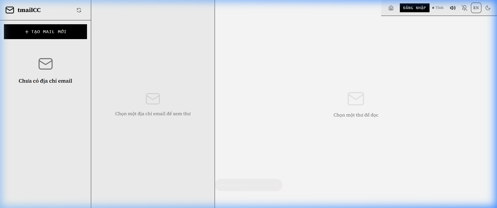
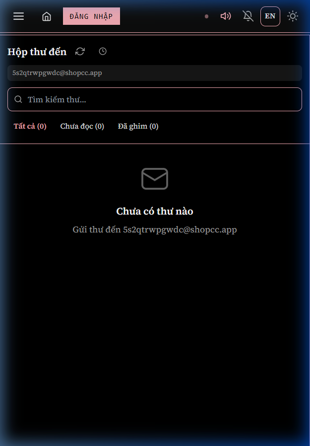
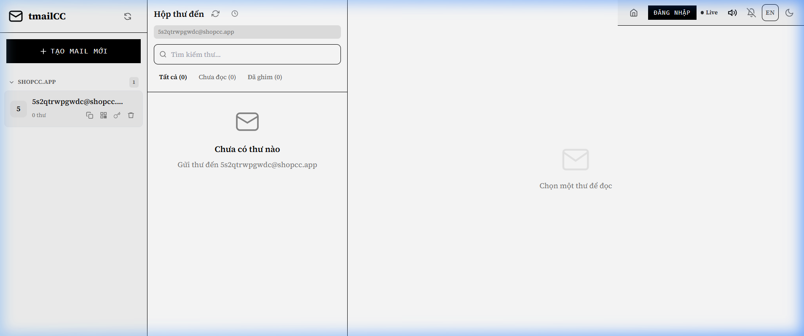
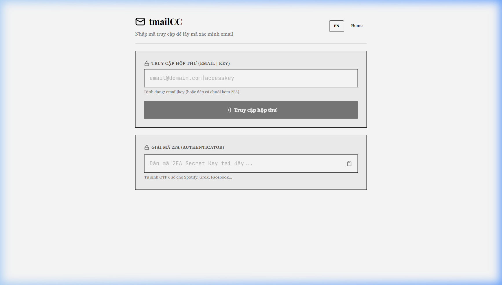
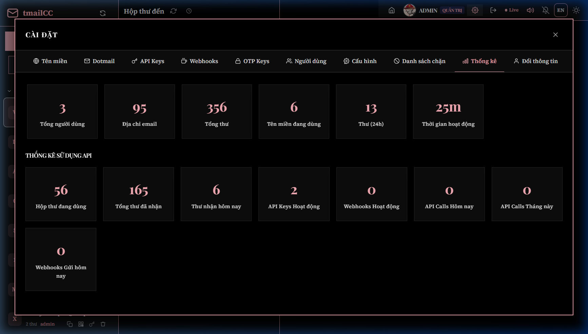
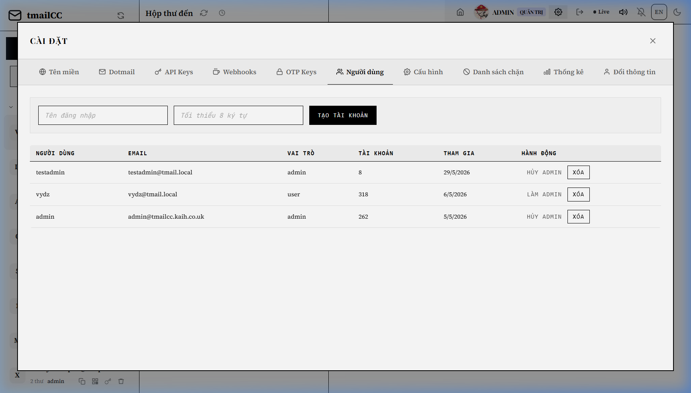
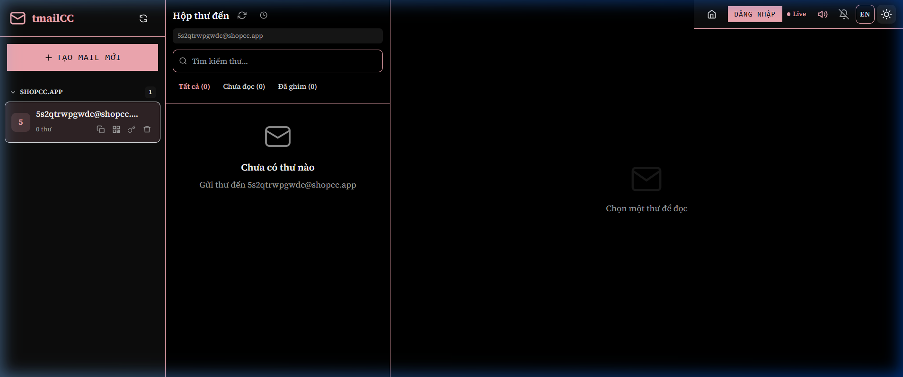
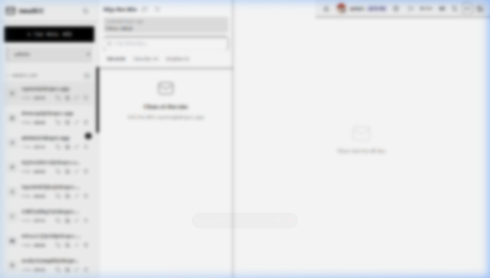
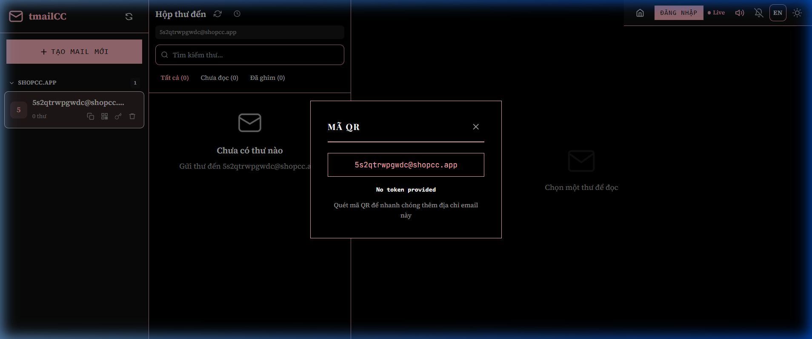
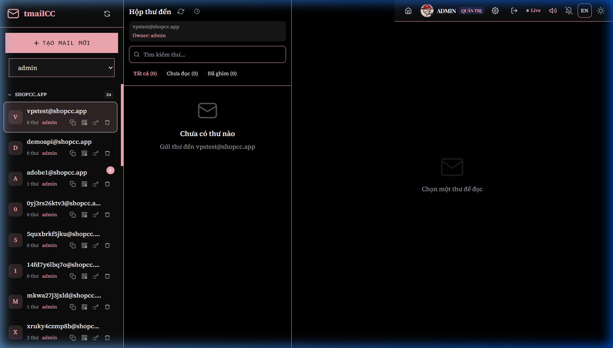

# BÁO CÁO ĐỒ ÁN CUỐI KỲ

---

# TRANG BÌA

---

**[LOGO / TÊN TRƯỜNG — ĐẠI HỌC BÁCH KHOA THÀNH PHỐ HỒ CHÍ MINH]**

&nbsp;

**Môn học:** Các công nghệ mới trong phát triển phần mềm

**Lớp:** CTK46-PM — Công nghệ thông tin, Khoá 46, Chuyên ngành Kỹ thuật phần mềm

&nbsp;

&nbsp;

&nbsp;

# BÁO CÁO ĐỒ ÁN CUỐI KỲ

&nbsp;

**Tên đề tài:** tmailCC — Hệ thống Webmail tạm thời (Temporary Email Service)

&nbsp;

&nbsp;

&nbsp;

| | |
|:---|:---|
| **Họ và tên:** | Nguyễn Huỳnh Tiến Khải |
| **Mã sinh viên:** | 2212385 |
| **Lớp:** | CTK46-PM |
| **Giảng viên hướng dẫn:** | Nguyễn Trọng Hiếu |
| **Ngày nộp:** | 29/05/2026 |

&nbsp;

&nbsp;

&nbsp;

**Địa chỉ production:** https://tmailcc.app

**Kho mã nguồn:** https://github.com/intekaih/tmailCC.git

---

# MỤC LỤC

---

**[Ghi chú: Khi chuyển sang PDF, sử dụng tính năng tạo mục lục tự động của Word/LibreOffice để sinh số trang.]**

---

- **TRANG BÌA** ...................................................... Trang
- **MỤC LỤC** ...................................................... Trang
- **Chương 1: Giới thiệu** ..................................................... Trang
  - 1.1. Bối cảnh và vấn đề .................................................. Trang
  - 1.2. Mục tiêu đề tài ...................................................... Trang
  - 1.3. Phạm vi đề tài ...................................................... Trang
  - 1.4. Đối tượng sử dụng .................................................. Trang
- **Chương 2: Công nghệ sử dụng** ............................................ Trang
  - 2.1. Next.js 14 (App Router) ............................................ Trang
  - 2.2. TypeScript ....................................................... Trang
  - 2.3. Supabase ......................................................... Trang
  - 2.4. Tailwind CSS ...................................................... Trang
  - 2.5. Docker ........................................................... Trang
  - 2.6. Cloudflare ...................................................... Trang
  - 2.7. Các thư viện bổ sung .............................................. Trang
- **Chương 3: Kiến trúc hệ thống** ............................................ Trang
  - 3.1. Kiến trúc tổng quan ................................................ Trang
  - 3.2. Cấu trúc thư mục dự án .............................................. Trang
  - 3.3. Thiết kế Database (ERD/Schema) ...................................... Trang
  - 3.4. Row Level Security (RLS) ........................................... Trang
  - 3.5. Luồng xử lý email inbound ........................................... Trang
- **Chương 4: Phân tích chức năng** ........................................... Trang
  - 4.1. Quản lý tài khoản email ............................................. Trang
  - 4.2. Quản lý email ..................................................... Trang
  - 4.3. Thông báo thời gian thực ........................................... Trang
  - 4.4. Xác thực người dùng ............................................... Trang
  - 4.5. Cài đặt người dùng ................................................ Trang
  - 4.6. Trang OTP ........................................................ Trang
  - 4.7. Chức năng Admin .................................................. Trang
  - 4.8. Bảo mật .......................................................... Trang
  - 4.9. Developer API .................................................... Trang
  - 4.10. Email Infrastructure .............................................. Trang
- **Chương 5: AI trong phát triển** ............................................. Trang
  - 5.1. Công cụ AI đã sử dụng .............................................. Trang
  - 5.2. Bảng tổng hợp Prompts chính ........................................ Trang
  - 5.3. Phân tích hiệu quả sử dụng AI ...................................... Trang
  - 5.4. Bài học rút ra .................................................... Trang
- **Chương 6: Docker và Deployment** ............................................ Trang
  - 6.1. Dockerfile ....................................................... Trang
  - 6.2. Docker Compose .................................................. Trang
  - 6.3. Quy trình triển khai VPS .......................................... Trang
  - 6.4. Kiến trúc deployment production ................................... Trang
  - 6.5. Các biến môi trường ............................................... Trang
  - 6.6. Kiểm tra hoạt động ............................................... Trang
- **Chương 7: Kết luận và hạn chế** ........................................... Trang
  - 7.1. Kết luận ......................................................... Trang
  - 7.2. Hạn chế .......................................................... Trang
  - 7.3. Hướng phát triển .................................................. Trang
- **Chương 8: Tài liệu tham khảo** ........................................... Trang

---

# Chương 1: Giới thiệu

---

## 1.1. Bối cảnh và vấn đề

Trong thời đại số hóa, người dùng internet phải đăng ký tài khoản trên hàng trăm dịch vụ trực tuyến, dẫn đến hộp thư cá nhân bị tràn ngập bởi email quảng cáo và thông báo không mong muốn. Theo Statista (2024), trung bình mỗi người nhận khoảng 120 email/ngày, trong đó 45–55% là spam. Việc cung cấp email cá nhân cho các trang web còn tiềm ẩn rủi ro bảo mật — email có thể bị rò rỉ qua các vụ tấn công cơ sở dữ liệu, bị bán cho bên thứ ba, hoặc bị khai thác cho phishing.

Trên thị trường đã có nhiều dịch vụ email tạm thời (Guerrilla Mail, TempMail, Mailinator...) nhưng đều có hạn chế: giao diện lỗi thời, thời gian sử dụng ngắn, hộp thư công khai không bảo mật, không hỗ trợ real-time notifications hay Developer API.

tmailCC ra đời nhằm khắc phục toàn bộ các hạn chế trên, mang đến một giải pháp email tạm thời toàn diện, hiện đại và chuyên nghiệp.


*Hình 1.1: Giao diện trang chủ tmailCC trên desktop (Light mode)*


*Hình 1.2: Giao diện tmailCC trên mobile (responsive view, Dark mode)*

---

## 1.2. Mục tiêu đề tài

### 1.2.1. Xây dựng hệ thống email tạm thời full-stack hiện đại

Mục tiêu chính của đề tài là xây dựng một hệ thống webmail tạm thời hoàn chỉnh từ front-end đến back-end, cho phép người dùng tạo địa chỉ email dùng một lần một cách nhanh chóng, nhận email trong thời gian thực, và quản lý nhiều tài khoản email cùng lúc. Hệ thống được thiết kế theo kiến trúc modern web application với giao diện người dùng trực quan, đáp ứng đầy đủ nhu cầu thực tế.

### 1.2.2. Áp dụng các công nghệ mới: Next.js 14 App Router, Supabase, Docker

Đề tài áp dụng bộ công nghệ hiện đại và được cộng đồng developer đánh giá cao: Next.js 14 với kiến trúc App Router thế hệ mới, Supabase như nền tảng Backend-as-a-Service cung cấp database, authentication và real-time subscriptions, Docker để đóng gói và triển khai ứng dụng, và Tailwind CSS cho styling. Việc lựa chọn này thể hiện xu hướng phát triển web hiện đại, nơi các nhà phát triển ưu tiên sử dụng các công cụ có sẵn, giảm thiểu thời gian cấu hình hạ tầng và tập trung vào logic nghiệp vụ.

### 1.2.3. Triển khai thực tế lên VPS với domain và SSL

Ngoài việc phát triển, đề tài còn hướng đến triển khai thực tế trên môi trường production với domain riêng (tmailcc.app) và chứng chỉ SSL, đảm bảo kết nối an toàn qua giao thức HTTPS. Quy trình triển khai được thiết kế có thể lặp lại (reproducible) thông qua Docker và Docker Compose.

### 1.2.4. Tích hợp AI tools trong quá trình phát triển

Đề tài đặc biệt chú trọng việc ứng dụng các công cụ AI như Cursor AI (GitHub Copilot) và Claude (Anthropic) trong suốt quá trình phát triển — từ thiết kế kiến trúc, viết code, tối ưu hiệu năng, cho đến soạn thảo tài liệu. Qua đó đánh giá hiệu quả thực tế của AI tools trong phát triển phần mềm và rút ra bài học kinh nghiệm.

---

## 1.3. Phạm vi đề tài

### 1.3.1. Các tính năng chính được triển khai

Dự án tmailCC tập trung vào các nhóm tính năng cốt lõi sau:

- **Quản lý tài khoản email:** Người dùng có thể tạo email ngẫu nhiên hoặc tùy chỉnh, chọn domain, quản lý nhiều tài khoản cùng lúc, xóa tài khoản, sao chép địa chỉ, xem QR code, và tạo OTP key.

- **Nhận email real-time:** Hệ thống hỗ trợ nhận email thông qua Cloudflare Worker, phân tích nội dung email (HTML/text), xử lý file đính kèm, và thông báo đến người dùng ngay lập tức qua Supabase Realtime.

- **Admin Panel:** Giao diện quản trị cho phép quản lý người dùng, quản lý domain, cấu hình hệ thống, IP blocklist, và OTP keys.

- **OTP Access:** Trang đặc biệt cho phép xem email không cần đăng nhập, với tính năng tự động nhận diện mã OTP trong nội dung email.

- **Developer API:** Hệ thống API Keys với phân quyền chi tiết theo scopes, các endpoint RESTful v1, và hệ thống Webhook với chữ ký HMAC.

### 1.3.2. Phạm vi không bao gồm

Đề tài không bao gồm các chức năng sau và được ghi nhận là hạn chế:

- Chức năng gửi email ra ngoài (outbound SMTP) — hệ thống chỉ nhận email inbound.
- Bộ lọc thư rác tự động dựa trên nội dung (AI spam filter).
- Ứng dụng di động native (hiện chỉ có giao diện web responsive).

---

## 1.4. Đối tượng sử dụng

### 1.4.1. Người dùng cuối (end users)

Đối tượng chính của hệ thống là những người cần địa chỉ email tạm thời để đăng ký dịch vụ trực tuyến mà không muốn sử dụng email cá nhân. Đây có thể là lập trình viên cần test email workflow, người dùng muốn bảo vệ quyền riêng tư, hoặc bất kỳ ai cần nhận email xác minh mà không muốn spam trong hộp thư chính.

### 1.4.2. Quản trị viên hệ thống (administrators)

Quản trị viên có quyền truy cập Admin Panel để giám sát hoạt động của hệ thống, quản lý người dùng (tạo, xóa, phân quyền admin), quản lý danh sách domain, cấu hình các thông số hệ thống (rate limit, storage limit), và xử lý IP blocklist để ngăn chặn các hành vi lạm dụng.

### 1.4.3. Nhà phát triển bên thứ ba (third-party developers)

Thông qua Developer API, các nhà phát triển có thể tích hợp chức năng nhận email tạm thời vào ứng dụng hoặc dịch vụ của riêng mình. Hệ thống API Keys với scopes cho phép phân quyền chi tiết, và Webhook cho phép nhận thông báo sự kiện (email nhận được, OTP được phát hiện) một cách tự động.

---

# Chương 2: Công nghệ sử dụng

---

## 2.1. Next.js 14 (App Router)

Next.js là framework React được phát triển bởi Vercel. Next.js 14 sử dụng kiến trúc App Router — routing dựa trên file system, trong đó mỗi thư mục trong `app/` đại diện cho một route. Điểm khác biệt cốt lõi so với Pages Router là App Router hỗ trợ React Server Components (RSC) mặc định, giảm đáng kể kích thước JavaScript bundle.

| Tiêu chí | Pages Router | App Router |
|---|---|---|
| Server Components | Không hỗ trợ | Hỗ trợ mặc định |
| Data Fetching | `getServerSideProps`, `getStaticProps` | Async Components + `fetch()` |
| Layout | `_app.tsx`, `_document.tsx` | `layout.tsx` lồng nhau |
| Metadata API | `<Head>` component | Metadata API tập trung |
| Streaming | Thủ công | Tích hợp sẵn với Suspense |

Trong tmailCC, App Router được tổ chức với **Root Layout** (`client/app/layout.tsx`) quản lý metadata và providers, **Route Groups** nhóm các route theo layout, và **API Routes** (`client/app/api/`) thay thế Express.js backend. Next.js phân biệt **Server Components** (mặc định, render phía server) và **Client Components** (đánh dấu `"use client"`, xử lý tương tác). Hầu hết components tương tác như `EmailList.tsx`, `Sidebar.tsx`, `AdminPanel.tsx` là Client Components.

### 2.1.4. Server Components và Client Components

Next.js phân biệt rõ ràng giữa Server Components và Client Components:

- **Server Components**: Render ở phía server, có thể truy cập trực tiếp database, filesystem, và các biến môi trường. Đây là default trong App Router. Trong tmailCC, `page.tsx` ở root là Server Component, có thể truy cập `process.env` để lấy `NEXT_PUBLIC_APP_URL` và định nghĩa metadata.

- **Client Components**: Yêu cầu JavaScript phía client để xử lý tương tác người dùng (useState, useEffect, event handlers). Được đánh dấu bằng directive `"use client"` ở đầu file. Trong tmailCC, hầu hết các component tương tác như `EmailList.tsx`, `Sidebar.tsx`, `AdminPanel.tsx` đều là Client Components.

---

## 2.2. TypeScript

TypeScript (strict mode) đóng vai trò then chốt trong việc đảm bảo tính nhất quán dữ liệu giữa front-end và back-end. Dự án định nghĩa các interface chính trong `client/lib/types.ts` với convention **camelCase** phía client, mapping sang **snake_case** của PostgreSQL trong API routes:

| Interface | Thuộc tính chính | File |
|---|---|---|
| `User` | id, username, email, role, preferences | `types.ts` |
| `Account` | id, address, localPart, domain, emailCount | `types.ts` |
| `Email` | id, from, subject, text, html, attachments, isRead | `types.ts` |
| `Domain` | id, domain, label, isActive, isDefault | `types.ts` |

API client (`client/lib/api.ts`) cung cấp các hàm type-safe như `getAccounts(): Promise<Account[]>`, `createAccount()`, `getEmails()`, giúp IDE cung cấp autocomplete và compiler báo lỗi nếu sử dụng sai thuộc tính. Dự án cũng định nghĩa các standardized API response helpers `apiOk<T>()` và `apiErr()` để thống nhất format response.

---

## 2.3. Supabase

### 2.3.1. Giới thiệu Supabase

Supabase là một nền tảng Backend-as-a-Service mã nguồn mở, được xây dựng trên PostgreSQL — một trong những hệ quản trị cơ sở dữ liệu quan hệ mạnh mẽ và đáng tin cậy nhất thế giới. Supabase cung cấp một bộ công cụ toàn diện giúp đơn giản hóa việc phát triển back-end: database quan hệ, authentication, real-time subscriptions, storage, và các tính năng bảo mật cấp doanh nghiệp.

Khác với Firebase — đối thủ chính trong mảng BaaS — Supabase sử dụng PostgreSQL thay vì NoSQL, mang lại nhiều ưu điểm về tính nhất quán dữ liệu (ACID compliance), khả năng truy vấn phức tạp bằng SQL chuẩn, và Row Level Security (RLS) cho phép kiểm soát truy cập ở cấp độ dòng một cách mạnh mẽ.

### 2.3.2. Các thành phần Supabase đã sử dụng trong tmailCC

**Authentication**: Supabase Auth cung cấp hệ thống xác thực người dùng với nhiều phương thức: email/password, magic link, OAuth providers. Trong tmailCC, email/password được sử dụng làm phương thức chính. Supabase Auth tích hợp trực tiếp với bảng `auth.users` trong PostgreSQL và tự động trigger các function khi user được tạo hoặc cập nhật.

**Database (PostgreSQL)**: Đây là thành phần cốt lõi, lưu trữ toàn bộ dữ liệu của hệ thống bao gồm profiles, accounts, emails, domains, config, ip_blocklist, otp_keys, api_keys, webhooks, và các bảng liên quan. Với 11 bảng dữ liệu và hơn 30 RLS policies, database được thiết kế để đảm bảo bảo mật ở mọi cấp độ truy cập.

**Realtime**: Supabase Realtime cho phép các client đăng ký (subscribe) các thay đổi trong database thông qua WebSocket. Khi có email mới được insert vào bảng `emails`, Supabase gửi sự kiện INSERT qua WebSocket đến tất cả các client đã subscribe channel tương ứng. Client xử lý sự kiện để cập nhật giao diện ngay lập tức mà không cần reload trang.

**Storage**: Supabase Storage được sử dụng để lưu trữ các file đính kèm của email. Mỗi file đính kèm được upload lên Supabase Storage bucket riêng, với RLS policies kiểm soát quyền truy cập.

### 2.3.3. So sánh với Firebase

| Tiêu chí | Supabase | Firebase |
|---|---|---|
| Database | PostgreSQL (SQL, quan hệ) | Firestore (NoSQL, document) |
| Truy vấn | SQL chuẩn, JOIN phức tạp | Limited query, denormalization |
| Bảo mật | RLS ở cấp database | Security Rules (custom syntax) |
| Realtime | PostgreSQL LISTEN/NOTIFY + WS | Firestore onSnapshot |
| Mã nguồn | Mã nguồn mở | Đóng (Google) |
| Migration | Dễ dàng với SQL | Phức tạp, cần backup |
| Ecosystem | Tương thích PostgreSQL ecosystem | Google ecosystem |

Supabase được chọn vì khả năng viết SQL truy vấn dữ liệu phức tạp một cách dễ dàng (rất quan trọng khi cần truy vấn email theo nhiều điều kiện lọc), RLS mạnh mẽ ở cấp database, và mã nguồn mở cho phép self-host nếu cần.

---

## 2.4. Tailwind CSS

Tailwind CSS là utility-first CSS framework, cung cấp các utility classes cấp thấp cho phép developer xây dựng giao diện trực tiếp trong JSX/TSX. Ưu điểm: tốc độ phát triển nhanh, kích thước bundle nhỏ (tree-shaking CSS unused), và nhất quán thiết kế.

**Dark/Light mode**: tmailCC sử dụng CSS Variables kết hợp Tailwind, triển khai hệ thống thiết kế "Minimalist Monochrome". Light mode sử dụng bảng màu đen-trắng hoàn toàn, trong khi Dark mode sử dụng accent color "Sakura Pink" (`#F4ABB4`) trên nền đen. Chuyển đổi qua attribute `data-theme` trên thẻ `<html>`.

**Responsive**: Layout 3 cột (sidebar – email list – email viewer) sử dụng breakpoints `md:` (768px) và `lg:` (1024px). Trên mobile, sidebar ẩn và email list chiếm full width.

---

## 2.5. Docker

### 2.5.1. Dockerfile multi-stage build

Docker được sử dụng để đóng gói ứng dụng tmailCC thành một container image có thể triển khai trên bất kỳ môi trường nào có Docker Engine. Dockerfile của dự án sử dụng kỹ thuật multi-stage build với 3 giai đoạn:

**Stage 1 — Dependencies (`deps`)**: Sử dụng image `node:20-alpine`, cài đặt các npm dependencies từ `package.json` và `package-lock.json`. Alpine Linux được chọn vì kích thước image nhỏ gọn.

**Stage 2 — Builder (`builder`)**: Copy `node_modules` từ stage deps, copy toàn bộ source code từ thư mục `client/`, thiết lập biến môi trường (`NEXT_TELEMETRY_DISABLED=1`, `NODE_ENV=production`), và chạy `npm run build` để tạo production build của Next.js.

**Stage 3 — Runner (`runner`)**: Chỉ copy các artifact cần thiết từ stage builder: thư mục `public/`, thư mục `.next/standalone` (standalone server output), và `.next/static`. Tạo non-root user (`nextjs`) để chạy ứng dụng với security principle of least privilege. Cấu hình health check endpoint để Docker engine có thể giám sát trạng thái container.

Kết quả của multi-stage build là image production có kích thước tối ưu, chỉ chứa runtime và artifact đã build, không chứa source code hay các công cụ build.

### 2.5.2. Docker Compose configuration

File `docker-compose.yml` định nghĩa service `tmail` với các cấu hình: build context trỏ đến Dockerfile trong thư mục gốc, container name, port mapping (3000:3000), các biến môi trường từ file `.env`, health check, và network. Docker Compose đơn giản hóa quy trình triển khai — chỉ cần một lệnh `docker-compose up -d` để khởi chạy toàn bộ hệ thống.

---

## 2.6. Cloudflare

### 2.6.1. DNS Management

Cloudflare được sử dụng làm DNS provider cho domain tmailcc.app. Việc sử dụng Cloudflare thay vì DNS mặc định của registrar mang lại nhiều lợi ích: tốc độ phân giải DNS nhanh hơn nhờ mạng lưới CDN toàn cầu, quản lý DNS tập trung và trực quan qua dashboard, và tính năng DNS failover.

### 2.6.2. SSL/TLS (Universal Certificate)

Cloudflare cung cấp chứng chỉ SSL miễn phí (Universal SSL Certificate) cho tất cả các domain được thêm vào Cloudflare. Chứng chỉ này được quản lý và tự động renew bởi Cloudflare, không cần cấu hình thủ công. Trong kiến trúc production của tmailCC, SSL được thiết lập ở chế độ "Full" — Cloudflare mã hóa kết nối giữa người dùng và Cloudflare, còn kết nối từ Cloudflare đến VPS có thể cấu hình riêng (Origin Certificate hoặc self-signed certificate với Flexible mode).

### 2.6.3. Cloudflare Tunnel

Cloudflare Tunnel (trước đây là ngrok) cho phép expose các service trên VPS ra internet mà không cần mở port trên firewall. Thay vì cấu hình NAT port forwarding và mở port 80/443 trên firewall của VPS, Cloudflare Tunnel tạo một kết nối outbound an toàn từ VPS đến mạng Cloudflare, và Cloudflare proxy lưu lượng HTTP/HTTPS vào tunnel này. Điều này tăng cường bảo mật đáng kể vì port của VPS không bao giờ được expose trực tiếp ra internet.

### 2.6.4. DDoS Protection

Cloudflare cung cấp bảo vệ DDoS miễn phí ở layer 3, 4 và 7 cho tất cả các domain được proxy. Khi tmailCC được deploy lên production với Cloudflare proxy, hệ thống tự động được bảo vệ khỏi các cuộc tấn công DDoS phổ biến mà không cần cấu hình thêm.

---

## 2.7. Các thư viện bổ sung

### 2.7.1. Bảng tổng hợp dependencies chính

Dưới đây là các dependencies chính được sử dụng trong dự án, được phân nhóm theo chức năng:

| Nhóm | Package | Phiên bản | Vai trò |
|------|---------|-----------|---------|
| **Framework** | `next` | 14.2.4 | Next.js framework |
| **React** | `react` | 18.3.1 | React UI library |
| **Database** | `@supabase/supabase-js` | 2.105.3 | Supabase client |
| **Database** | `@supabase/ssr` | 0.10.3 | SSR-friendly Supabase client |
| **Database** | `pg` | 8.21.0 | PostgreSQL driver |
| **Auth** | `jsonwebtoken` | 9.0.3 | JWT token handling |
| **Email** | `mailparser` | 3.9.8 | Email parsing (MIME) |
| **Email** | `imapflow` | 1.3.3 | IMAP client |
| **Utilities** | `qrcode` | 1.5.4 | QR code generation |
| **Utilities** | `joi` | 17.13.3 | Schema validation |
| **Utilities** | `clsx` | 2.1.1 | Conditional class names |
| **Utilities** | `tailwind-merge` | 2.5.4 | Tailwind class merging |
| **CSS** | `tailwindcss` | 3.4.15 | Utility CSS framework |
| **Dev** | `typescript` | 5.4.5 | TypeScript compiler |
| **Dev** | `eslint` | 8.57.0 | Linter |

<!-- SCREENSHOT: Bảng so sánh công nghệ (có thể tạo bảng trong MD) -->

---

# Chương 3: Kiến trúc hệ thống

---

## 3.1. Kiến trúc tổng quan

### 3.1.1. Sơ đồ kiến trúc

Hệ thống tmailCC được triển khai theo kiến trúc multi-tier với các tầng được phân tách rõ ràng. Dưới đây là luồng xử lý request từ người dùng đến cơ sở dữ liệu:

```
┌──────────────────────────────────────────────────────────────────────┐
│                         USER BROWSER                                   │
│  ┌────────────────────────────────────────────────────────────────┐  │
│  │  Next.js App (SPA)                                              │  │
│  │  ├── Landing Page (/, /app)                                    │  │
│  │  ├── OTP Page (/otp)                                           │  │
│  │  └── Admin Panel (/app/admin)                                   │  │
│  │                                                                  │  │
│  │  Công nghệ: React 18, TypeScript, Tailwind CSS                  │  │
│  └────────────────────────────────────────────────────────────────┘  │
│                                    │                                   │
│                                    │ HTTPS (443)                      │
└────────────────────────────────────┼──────────────────────────────────┘
                                     │
                                     ▼
┌──────────────────────────────────────────────────────────────────────┐
│                         CLOUDFLARE                                     │
│  ┌────────────────────────────────────────────────────────────────┐  │
│  │  - DNS Resolution (tmailcc.app → VPS IP)                       │  │
│  │  - SSL/TLS Termination (Universal Certificate)                 │  │
│  │  - DDoS Protection (Layer 3/4/7)                               │  │
│  │  - CDN Cache (static assets)                                   │  │
│  │  - Cloudflare Tunnel (kết nối bảo mật đến VPS)                 │  │
│  └────────────────────────────────────────────────────────────────┘  │
└──────────────────────────────────────────────────────────────────────┘
                                     │
                                     ▼
┌──────────────────────────────────────────────────────────────────────┐
│                    VPS (Virtual Private Server)                        │
│                                                                          │
│  ┌────────────────────────────────────────────────────────────────┐   │
│  │  NGINX (Reverse Proxy)                                           │   │
│  │  Port 80 (HTTP → 301 redirect to HTTPS)                          │   │
│  │  Port 443 (HTTPS → localhost:3000)                                │   │
│  │  ├── Rate limiting                                              │   │
│  │  ├── Gzip compression                                           │   │
│  │  ├── Security headers (X-Frame-Options, X-Content-Type-Options)  │   │
│  │  └── WebSocket proxy (Supabase Realtime)                         │   │
│  └────────────────────────────────────────────────────────────────┘   │
│                                    │                                   │
│                                    ▼                                   │
│  ┌────────────────────────────────────────────────────────────────┐   │
│  │  DOCKER CONTAINER                                                │   │
│  │  ┌──────────────────────────────────────────────────────────┐   │   │
│  │  │  NEXT.JS PRODUCTION BUILD (Standalone Mode)                │   │   │
│  │  │  Port 3000                                                  │   │   │
│  │  │  ├── API Routes (auth, accounts, emails, admin)            │   │   │
│  │  │  ├── SSR/SSG Pages                                        │   │   │
│  │  │  └── Static Assets                                        │   │   │
│  │  └──────────────────────────────────────────────────────────┘   │   │
│  └────────────────────────────────────────────────────────────────┘   │
└──────────────────────────────────────────────────────────────────────┘
                    │                              │
         ┌──────────┴──────────┐       ┌───────────┴───────────┐
         │                      │       │                       │
         ▼                      ▼       ▼                       ▼
┌─────────────────────┐ ┌──────────────┐ ┌────────────────────────┐
│   SUPABASE CLOUD    │ │ CLOUDFLARE   │ │  EXTERNAL SMTP/IMAP     │
│                      │ │   WORKER     │ │                        │
│ ┌─────────────────┐ │ │              │ │  Các server bên ngoài  │
│ │ PostgreSQL       │ │ Email inbound │ │  gửi email đến         │
│ │ - profiles       │ │ webhook       │ │  @tmailcc.app          │
│ │ - accounts       │ └──────────────┘ └────────────────────────┘
│ │ - emails         │
│ │ - domains        │
│ │ - config         │
│ │ - otp_keys       │
│ │ - ip_blocklist   │
│ │ - api_keys       │
│ │ - webhooks       │
│ ├─────────────────┤ │
│ │ Authentication   │ │
│ │ (Email/Password) │ │
│ ├─────────────────┤ │
│ │ Realtime         │ │
│ │ (WebSocket)      │ │
│ ├─────────────────┤ │
│ │ Storage          │ │
│ │ (Attachments)    │ │
│ └─────────────────┘ │
└─────────────────────┘
```

### 3.1.2. Giải thích chi tiết từng tầng

**Tầng 1 — Browser (Client)**: Người dùng tương tác với ứng dụng thông qua trình duyệt web. Next.js phục vụ một ứng dụng React (SPA) với Server-Side Rendering cho các trang đầu tiên để tối ưu SEO. Các tương tác sau đó được xử lý hoàn toàn phía client.

**Tầng 2 — Cloudflare (Edge)**: Cloudflare đóng vai trò reverse proxy ở lớp edge, xử lý SSL termination, DNS resolution, và DDoS protection. Tất cả traffic HTTP/HTTPS đi qua Cloudflare trước khi đến VPS.

**Tầng 3 — VPS & Nginx (Infrastructure)**: VPS chạy Nginx làm reverse proxy, chuyển tiếp request đến Docker container đang chạy Next.js. Nginx cung cấp thêm các tính năng như rate limiting, gzip compression, và bảo mật headers.

**Tầng 4 — Docker (Application)**: Container chạy Next.js production build ở standalone mode, xử lý business logic và giao tiếp với các dịch vụ bên ngoài.

**Tầng 5 — Supabase (Data Layer)**: Toàn bộ dữ liệu được lưu trữ và quản lý bởi Supabase — PostgreSQL database, authentication, realtime subscriptions, và storage.

<!-- SCREENSHOT: Sơ đồ kiến trúc hệ thống (vẽ bằng draw.io hoặc tương tự) -->

---

## 3.2. Cấu trúc thư mục dự án

```
tmailCC/
├── client/                     # Next.js 14 frontend (App Router)
│   ├── app/                    # App Router routes
│   │   ├── api/                # API Routes (auth, accounts, emails, admin, otp, webhook)
│   │   ├── landing/            # Landing page
│   │   ├── otp/                # OTP access page
│   │   └── docs/               # Documentation pages
│   ├── components/             # React components (email/, account/, auth/, admin/, ui/)
│   └── lib/                    # Utilities (api.ts, types.ts, realtime.ts, i18n.ts, ...)
├── worker/                     # Cloudflare Worker (email inbound)
├── supabase/                   # Database migrations (schema.sql, migration_*.sql)
├── docs/                       # Tài liệu dự án
├── Dockerfile                  # Multi-stage Docker build
├── docker-compose.yml          # Docker Compose config
└── .env.example                # Environment template
```

**Vai trò các thư mục chính:**
- **`client/app/api/`**: API routes thay thế Express.js backend, tổ chức theo nhóm chức năng
- **`client/components/`**: React components theo nguyên tắc feature-based
- **`client/lib/`**: API client, Supabase client, i18n, realtime subscriptions, React contexts
- **`worker/`**: Cloudflare Worker nhận email inbound, parse MIME và forward đến webhook
- **`supabase/`**: SQL migrations — `schema.sql` định nghĩa tables, indexes, triggers, RLS policies

---

## 3.3. Thiết kế Database (ERD/Schema)

### 3.3.1. Các bảng trong hệ thống

Supabase sử dụng PostgreSQL làm engine, với 11 bảng dữ liệu được thiết kế theo nguyên tắc quan hệ chặt chẽ (normalized). Dưới đây là mô tả chi tiết từng bảng:

**`public.profiles`** — Bảng mở rộng `auth.users` từ Supabase Auth. Mỗi user trong hệ thống có một row trong bảng này chứa thông tin bổ sung: username, email, role (user hoặc admin), preferences (JSONB cho dark mode, notifications, sound), ip_addresses (JSONB tracking), và email_count (số email đã nhận).

**`public.domains`** — Danh sách các domain khả dụng để tạo email tạm thời (ví dụ: tmailcc.app, mail.tmailcc.app). Mỗi domain có label hiển thị, cờ is_active để bật/tắt, và cờ is_default để chọn domain mặc định.

**`public.accounts`** — Các tài khoản email được tạo bởi người dùng. Mỗi account có địa chỉ email đầy đủ (local_part + domain), liên kết đến user sở hữu qua user_id, guest_owner_token_hash cho tài khoản khách, và các metadata như last_activity, email_count.

**`public.emails`** — Các thư được nhận. Chứa toàn bộ thông tin email: from_address, from_name, to_address, subject, text_content, html_content, attachments (JSONB array), headers (JSONB), message_id (để deduplicate), content_hash (để deduplicate), và các cờ trạng thái is_read, is_starred, is_deleted.

**`public.config`** — Key-value store cho cấu hình hệ thống. Lưu trữ rate limits, storage limits, CAPTCHA settings, maintenance mode, và các tham số khác dưới dạng JSONB.

**`public.ip_blocklist`** — Danh sách các IP bị cấm. Mỗi IP có thể có thời hạn block qua expires_at, và lý do block được ghi chú.

**`public.otp_keys`** — OTP access keys cho phép xem email không cần đăng nhập. Key được hash trước khi lưu, địa chỉ email được lưu dạng plain text để lookup.

**`public.api_keys`** — Developer API keys với các scopes: `domains:read`, `accounts:create`, `accounts:delete`, `emails:read`, `emails:delete`, `webhooks:manage`. Key được hash bằng SHA-256, chỉ lưu prefix và hint (4 ký tự cuối) để hiển thị.

**`public.api_usage_logs`** — Logs theo dõi việc sử dụng API: endpoint, method, status code, IP, user agent, response time. Tự động cleanup logs older than 30 days.

**`public.webhooks`** — Cấu hình webhook cho developer: URL endpoint, events (email.received, otp.detected), secret cho HMAC signing.

**`public.webhook_deliveries`** — Logs các lần gửi webhook: webhook_id, event, payload, response status, attempt count, next retry time.

### 3.3.2. Quan hệ giữa các bảng

```
auth.users ──1:1──▶ profiles (user_id = id)
profiles ──1:N──▶ accounts (user_id)
accounts ──1:N──▶ emails (account_id)
profiles ──1:N──▶ api_keys (user_id)
api_keys ──1:N──▶ api_usage_logs (api_key_id)
profiles ──1:N──▶ webhooks (user_id)
webhooks ──1:N──▶ webhook_deliveries (webhook_id)
```

**Trigger quan trọng**: `handle_new_user()` — tự động tạo row trong `profiles` khi user mới được đăng ký qua Supabase Auth. Trigger này đảm bảo mọi `auth.users` đều có profile tương ứng.

**RLS Summary**: Tất cả 11 bảng đều bật Row Level Security. Mỗi bảng có policies riêng kiểm soát quyền SELECT/INSERT/UPDATE/DELETE dựa trên `auth.uid()` và role của user.


---

## 3.4. Row Level Security (RLS)

RLS là cơ chế bảo mật cấp dòng trong PostgreSQL, được thực thi ngay ở database — ngay cả khi truy cập trực tiếp qua SQL Editor, policies vẫn áp dụng. Trong tmailCC, service role (bypass RLS) chỉ dùng trong API routes server-side, không bao giờ expose ra client.

**Các policies chính:**

- **Profiles**: 3 policies — xem chính mình hoặc admin xem tất cả, cập nhật chính mình, admin cập nhật bất kỳ ai
- **Accounts**: 5 policies + 1 policy anonymous SELECT (cần thiết cho Supabase Realtime WebSocket)
- **Emails**: 5 policies dùng subquery qua bảng accounts để xác định ownership (`EXISTS (SELECT 1 FROM accounts WHERE id = account_id AND user_id = auth.uid())`)
- **Domains**: Anonymous/authenticated xem domains active, admin CRUD
- **Config, ip_blocklist, otp_keys**: Chỉ admin

**Lưu ý quan trọng**: Policy `emails_select_anon` cho phép anonymous SELECT với `USING (true)`, cần thiết cho Supabase Realtime subscription dùng anon key. Email ID là UUID không thể đoán, nên không gây rủi ro bảo mật.

---

## 3.5. Luồng xử lý email inbound

### 3.5.1. Toàn bộ pipeline từ khi email được gửi đến khi hiển thị trên giao diện

Luồng xử lý email inbound trong tmailCC được thiết kế theo kiến trúc event-driven, với các bước sau:

**Bước 1 — Email được gửi đến MX record**: Khi một người gửi bên ngoài gửi email đến địa chỉ `something@tmailcc.app`, email được routing đến MX records của tmailcc.app. Với Cloudflare Email Routing, MX records trỏ đến Cloudflare thay vì VPS trực tiếp.

**Bước 2 — Cloudflare Email Routing tiếp nhận**: Cloudflare nhận email qua MX record, thực hiện spam scanning cơ bản, và chuyển tiếp email đến Cloudflare Worker thông qua email binding API.

**Bước 3 — Cloudflare Worker xử lý**: Worker parse email MIME, extract các thông tin cần thiết (from, to, subject, body, attachments, headers), và gửi HTTP POST đến webhook endpoint của tmailCC (`/api/webhook/inbound`) kèm theo WEBHOOK_SECRET để xác thực.

**Bước 4 — Next.js API webhook endpoint**: Endpoint `/api/webhook/inbound` nhận request, xác thực WEBHOOK_SECRET, sử dụng Supabase admin client (bypass RLS) để:
- Lookup account dựa trên địa chỉ email người nhận
- Insert email vào bảng `emails`
- Update `email_count` trên account
- Trigger Supabase Realtime event

**Bước 5 — Supabase Realtime thông báo client**: Supabase gửi sự kiện INSERT qua WebSocket đến tất cả các client đã subscribe channel `emails:{account_id}`.

**Bước 6 — Client cập nhật giao diện**: React component nhận sự kiện realtime, cập nhật state (thêm email mới vào danh sách), và kích hoạt các thông báo (âm thanh, browser notification, đồng bộ đa tab qua BroadcastChannel).

```
Email gửi đến @tmailcc.app
        │
        ▼
  MX Record → Cloudflare Email Routing
        │
        ▼
  Cloudflare Worker (parse MIME)
        │
        │ POST /api/webhook/inbound
        │ (with WEBHOOK_SECRET)
        ▼
  Next.js API Route (webhook/inbound)
        │
        │ INSERT emails
        │ (Supabase admin client)
        ▼
  Supabase PostgreSQL
        │
        │ INSERT event
        │ (via supabase_realtime publication)
        ▼
  Supabase Realtime (WebSocket)
        │
        ▼
  Browser Client (React)
        │
        ├── Thêm email vào danh sách
        ├── Browser Notification
        ├── Âm thanh thông báo
        └── BroadcastChannel đồng bộ đa tab
```

<!-- SCREENSHOT: Sơ đồ kiến trúc hệ thống (vẽ bằng draw.io hoặc tương tự) -->

---

# Chương 4: Phân tích chức năng

---

## 4.1. Quản lý tài khoản email

### 4.1.1. Tổng quan nhóm chức năng

Nhóm chức năng quản lý tài khoản email là nhóm nền tảng nhất của hệ thống tmailCC, cho phép người dùng tạo, quản lý và xóa các địa chỉ email tạm thời. Mỗi tài khoản email tồn tại dưới dạng một row trong bảng `public.accounts`, liên kết với người dùng sở hữu qua `user_id` hoặc `guest_owner_token_hash` (cho tài khoản khách).

### 4.1.2. Bảng liệt kê chức năng

| # | Tên chức năng | Mô tả | Trạng thái |
|---|:---|:---|:---:|
| 1 | Tạo email ngẫu nhiên | Hệ thống tự động tạo địa chỉ email với local part ngẫu nhiên (8 ký tự chữ và số) và domain ngẫu nhiên từ danh sách khả dụng. Người dùng click một lần để có ngay email mới. | Hoàn thành |
| 2 | Tạo email tùy chỉnh | Người dùng nhập local part tùy ý (3-64 ký tự, chỉ chữ cái, số, dấu chấm, dấu gạch dưới, dấu gạch ngang). Hệ thống kiểm tra trùng lặp trước khi tạo. | Hoàn thành |
| 3 | Chọn domain | Dropdown hiển thị tất cả domains đang active, với label mô tả và đánh dấu domain mặc định. Admin có thể thêm/xóa domain qua Admin Panel. | Hoàn thành |
| 4 | Xóa tài khoản email | Xóa account và toàn bộ emails liên quan (cascade delete qua FK constraint). Hiển thị confirm dialog trước khi xóa. | Hoàn thành |
| 5 | Sao chép địa chỉ | Click vào nút copy hoặc click trực tiếp vào địa chỉ email trên sidebar để copy vào clipboard. Sử dụng Clipboard API với fallback cho trình duyệt cũ. | Hoàn thành |
| 6 | Hiển thị QR code | Modal popup hiển thị QR code chứa địa chỉ email. QR code được tạo bằng thư viện `qrcode`, hỗ trợ tất cả các thiết bị quét QR. Kích thước QR code responsive. | Hoàn thành |
| 7 | Tạo OTP key | Sinh OTP access key ngẫu nhiên (32 ký tự hex) cho phép xem email qua trang `/otp` mà không cần đăng nhập. Key được hash bằng SHA-256 trước khi lưu vào database. | Hoàn thành |
| 8 | Nhiều tài khoản cùng lúc | Sidebar hiển thị danh sách tất cả tài khoản đã tạo, với unread count badge cho mỗi tài khoản. Click để chuyển đổi giữa các tài khoản. | Hoàn thành |
| 9 | Danh sách domain | API `/api/accounts/domains` trả về danh sách domains khả dụng. Chỉ domains có `is_active = true` được trả về, sorted by `is_default DESC, domain ASC`. | Hoàn thành |

### 4.1.3. Giải thích kỹ thuật

Khi tạo tài khoản, API route xử lý như sau:

1. Validate local_part (độ dài 3-64, regex pattern `/^[a-zA-Z0-9._-]+$/`)
2. Kiểm tra trùng lặp địa chỉ email trong database
3. Xác định domain (từ request body hoặc domain mặc định)
4. Kiểm tra user đã đạt giới hạn số account chưa (qua config `maxMailboxStorageMB`)
5. Insert vào bảng accounts với Supabase admin client
6. Trả về account object cho client

RLS policy `accounts_insert_own` đảm bảo user chỉ có thể tạo account với `user_id` là chính mình. Admin có thể tạo account cho user khác thông qua Supabase admin client (bypass RLS) trong API route.

---

## 4.2. Quản lý email

### 4.2.1. Tổng quan nhóm chức năng

Nhóm chức năng quản lý email cho phép người dùng xem, lọc, đánh dấu, và xóa các email trong hộp thư. Mỗi email được lưu trong bảng `public.emails` với đầy đủ thông tin về nội dung, file đính kèm, và trạng thái.

### 4.2.2. Bảng liệt kê chức năng

| # | Tên chức năng | Mô tả | Trạng thái |
|---|:---|:---|:---:|
| 1 | Xem danh sách hộp thư | Hiển thị emails theo thứ tự mới nhất (received_at DESC). Mỗi item hiển thị: from_name, subject (truncate 50 chars), thời gian nhận (tương đối: "2 phút trước"), và unread badge. Pagination với infinite scroll. | Hoàn thành |
| 2 | Xem nội dung email | Xem chi tiết email với 2 chế độ: HTML (sanitized) và Plain Text. Địa chỉ người gửi, người nhận, subject, thời gian được hiển thị ở phần header. | Hoàn thành |
| 3 | Đánh dấu đã đọc/chưa đọc | Toggle trạng thái `is_read` của email. Click vào email trong danh sách tự động mark as read. Nút "Mark as read" trên toolbar cho phép đánh dấu hàng loạt. | Hoàn thành |
| 4 | Đánh dấu sao (star) | Toggle trạng thái `is_starred` của email. Emails starred được hiển thị riêng trong filter "Starred". | Hoàn thành |
| 5 | Xóa email | Xóa email riêng lẻ qua DELETE `/api/emails/:id`. Soft delete (cờ `is_deleted`) hoặc hard delete tùy cấu hình. Hiển thị confirm dialog. | Hoàn thành |
| 6 | Xóa tất cả email | Bulk delete toàn bộ emails trong hộp thư hiện tại qua DELETE `/api/emails`. Hiển thị confirm dialog với số lượng email sẽ xóa. | Hoàn thành |
| 7 | Lọc email | 3 bộ lọc: All (tất cả), Unread (chỉ emails có is_read = false), Starred (chỉ emails có is_starred = true). Filter được áp dụng phía client sau khi fetch toàn bộ emails. | Hoàn thành |
| 8 | Tải attachment | Download file đính kèm qua endpoint riêng. Mỗi attachment có filename, contentType, size. Supabase Storage được sử dụng để lưu trữ file. | Hoàn thành |
| 9 | Inline image display | Hình ảnh inline trong email được hiển thị trực tiếp. CID (Content-ID) attachments được map vào các thẻ ``. External images có thể bị block theo cấu hình bảo mật. | Hoàn thành |

### 4.2.3. Giải thích kỹ thuật

Email HTML content được sanitize bằng `mailParser.ts` — loại bỏ tags nguy hiểm (`<script>`, `<iframe>`, event handlers), chỉ cho phép các tags an toàn (`b`, `i`, `a`, `p`, `img`). Attachments được xử lý qua Supabase Storage với CID mapping cho inline images.

---

## 4.3. Thông báo thời gian thực

### 4.3.1. Tổng quan nhóm chức năng

Tính năng thông báo thời gian thực là một trong những điểm nổi bật nhất của tmailCC, đảm bảo người dùng nhận được email mới ngay lập tức mà không cần reload trang. Hệ thống kết hợp nhiều công nghệ để đạt được trải nghiệm real-time mượt mà.

### 4.3.2. Bảng liệt kê chức năng

| # | Tên chức năng | Mô tả | Trạng thái |
|---|:---|:---|:---:|
| 1 | Supabase Realtime | Đăng ký WebSocket subscription đến Supabase cho channel `emails:{account_id}`. Khi có INSERT event trên bảng emails với `account_id` tương ứng, client nhận event và cập nhật giao diện. | Hoàn thành |
| 2 | Browser Notifications | Sử dụng Notification API để hiển thị thông báo hệ thống khi có email mới và tab trình duyệt đang ở background. Yêu cầu người dùng grant permission trước. | Hoàn thành |
| 3 | Âm thanh thông báo | Phát file âm thanh (định dạng MP3/WAV) khi có email mới. Người dùng có thể bật/tắt trong Settings. Âm thanh được preload để giảm độ trễ khi phát. | Hoàn thành |
| 4 | Đồng bộ đa tab | Sử dụng BroadcastChannel API để đồng bộ trạng thái giữa các tabs cùng mở ứng dụng. Khi một tab nhận email mới, nó broadcast event đến các tabs khác để cập nhật. | Hoàn thành |
| 5 | SSE fallback | Server-Sent Events được triển khai như fallback khi Supabase Realtime không khả dụng. SSE endpoint streaming events đến client. | Hoàn thành |

### 4.3.3. Giải thích kỹ thuật

Luồng realtime được triển khai qua `RealtimeContext` trong `client/lib/realtime.ts`:

- **Client-side filtering**: Hệ thống nhận TẤT CẢ INSERT events trên bảng `emails` qua `postgres_changes`, sau đó filter tại client (`payload.new.account_id !== accountId`) — cần thiết vì RLS policy `emails_select_anon` phải cho phép anonymous SELECT để Supabase WAL stream hoạt động.
- **Deduplication**: `SeenEmailsTracker` (max 1000 entries, 5 min TTL) ngăn duplicate notifications khi cả `postgres_changes` và broadcast channel cùng fire.
- **Broadcast channel**: Song song với `postgres_changes`, webhook endpoint gửi broadcast event khi nhận email mới — hoạt động nhanh hơn WAL stream.
- **Reconnection**: Exponential backoff (max 10 attempts, max 30s delay) khi mất kết nối WebSocket.
- **Publication**: Bảng `emails` và `accounts` phải được thêm vào `supabase_realtime` publication.

---

## 4.4. Xác thực người dùng

### 4.4.1. Tổng quan nhóm chức năng

Hệ thống xác thực của tmailCC được xây dựng trên Supabase Auth, với nhiều phương thức để phục vụ các use cases khác nhau: đăng ký/đăng nhập cho người dùng thường xuyên, và OTP access cho người dùng tạm thời.

### 4.4.2. Bảng liệt kê chức năng

| # | Tên chức năng | Mô tả | Trạng thái |
|---|:---|:---|:---:|
| 1 | Đăng ký tài khoản | Tạo tài khoản mới với username, email, password. Trigger `handle_new_user` tự động tạo row trong bảng `profiles`. Username phải unique. | Hoàn thành |
| 2 | Đăng nhập | Đăng nhập với email và password. Supabase Auth xác thực và trả về session (access token + refresh token). Access token là JWT chứa user ID và role. | Hoàn thành |
| 3 | Đăng xuất | Xóa session khỏi client, revoke refresh token trên Supabase. | Hoàn thành |
| 4 | Đổi mật khẩu | Người dùng đã đăng nhập có thể đổi mật khẩu qua form trong settings. Gọi Supabase Auth API để update password. | Hoàn thành |
| 5 | Chế độ khách (guest mode) | Người dùng có thể sử dụng hệ thống mà không cần đăng nhập. Tài khoản khách được track qua `guest_owner_token_hash` — một hash của token được lưu trong localStorage. | Hoàn thành |
| 6 | JWT Authentication | API routes xác thực JWT token từ header `Authorization: Bearer <token>`. Token được verify bằng `SUPABASE_JWT_SECRET`. Decoded payload chứa `sub` (user_id), `email`, và custom claims. | Hoàn thành |
| 7 | OTP Access | Truy cập email qua OTP key thay vì đăng nhập. Người dùng nhập `email|access_key` trên trang `/otp`. API verify hash của access_key với `access_key_hash` trong bảng `otp_keys`. | Hoàn thành |

### 4.4.3. Giải thích kỹ thuật

JWT token được tạo bởi Supabase Auth khi user đăng nhập, chứa các claims chuẩn (iss, sub, aud, exp, iat) và có thể thêm custom claims. Trong các API routes, JWT được verify như sau:

```typescript
// API route handler pattern
export async function GET(request: Request) {
  const authHeader = request.headers.get('Authorization');
  if (!authHeader?.startsWith('Bearer ')) {
    return NextResponse.json({ error: 'Unauthorized' }, { status: 401 });
  }
  
  const token = authHeader.split(' ')[1];
  const { data: { user }, error } = await supabase.auth.getUser(token);
  
  if (error || !user) {
    return NextResponse.json({ error: 'Invalid token' }, { status: 401 });
  }
  
  // Tiếp tục xử lý với user.id
}
```

---

## 4.5. Cài đặt người dùng

### 4.5.1. Tổng quan nhóm chức năng

Nhóm cài đặt cho phép người dùng tùy chỉnh giao diện và hành vi của ứng dụng theo sở thích cá nhân. Các preferences được lưu trong localStorage (phía client) và trong bảng `profiles.preferences` (phía server, đồng bộ khi đăng nhập).

### 4.5.2. Bảng liệt kê chức năng

| # | Tên chức năng | Mô tả | Trạng thái |
|---|:---|:---|:---:|
| 1 | Dark/Light mode | Toggle giữa chế độ giao diện tối và sáng. Class `dark` được thêm/xóa trên thẻ `<html>`. CSS variables thay đổi theo class, Tailwind auto-detect. | Hoàn thành |
| 2 | Bật/tắt âm thanh | Toggle âm thanh thông báo khi có email mới. Trạng thái được lưu trong localStorage dưới key `soundEnabled`. | Hoàn thành |
| 3 | Bật/tắt notifications | Toggle browser notifications. Nếu chưa có permission, hiển thị button để yêu cầu. | Hoàn thành |
| 4 | Đổi ngôn ngữ | Chuyển đổi giữa Tiếng Việt và Tiếng Anh. Object translations được định nghĩa trong `client/lib/i18n.ts`. Language preference được lưu trong localStorage. | Hoàn thành |
| 5 | Lưu preferences | Tất cả preferences (dark mode, sound, notifications, language) được serialize và lưu vào localStorage. Khi load app, preferences được đọc và apply. Khi đăng nhập, preferences cũng được sync lên `profiles.preferences` (JSONB). | Hoàn thành |

---

## 4.6. Trang OTP (Xem Email Không Cần Đăng Nhập)

### 4.6.1. Tổng quan nhóm chức năng

Trang OTP là một tính năng đặc biệt của tmailCC, cho phép xem email mà không cần tài khoản đăng nhập. Người dùng chỉ cần có địa chỉ email và OTP access key đã được admin tạo trước đó.

### 4.6.2. Bảng liệt kê chức năng

| # | Tên chức năng | Mô tả | Trạng thái |
|---|:---|:---|:---:|
| 1 | Xem email bằng OTP key | Truy cập qua URL `/otp?address=email@tmailcc.app&key=access_key_32chars`. API verify access_key_hash. Nếu hợp lệ, trả về danh sách emails của address đó. | Hoàn thành |
| 2 | Auto-detect OTP code | Khi xem một email, hệ thống tự động quét text content để tìm các pattern OTP phổ biến (4-8 chữ số, alphanumeric codes). Kết quả hiển thị nổi bật với nút copy. | Hoàn thành |
| 3 | One-click copy code | Khi OTP code được detect, hiển thị button "Copy" ngay bên cạnh. Click để copy code vào clipboard và hiển thị toast "Đã sao chép!". | Hoàn thành |
| 4 | Auto-refresh | Trang OTP tự động refresh danh sách email mỗi 15 giây. Countdown timer hiển thị thời gian đến lần refresh tiếp theo. Người dùng cũng có thể refresh thủ công. | Hoàn thành |
| 5 | Real-time status indicator | Indicator hiển thị trạng thái kết nối realtime: đang kết nối, đã kết nối, mất kết nối. Màu sắc: xám (đang kết nối), xanh (đã kết nối), đỏ (mất kết nối). | Hoàn thành |

### 4.6.3. Giải thích kỹ thuật

OTP verification sử dụng SHA-256 hashing thay vì lưu key ở dạng plain text:

```typescript
// Server-side OTP verification
import { createHash } from 'crypto';

export async function verifyOtpKey(address: string, accessKey: string): Promise<boolean> {
  const hashedKey = createHash('sha256').update(accessKey).digest('hex');
  
  const { data, error } = await supabaseAdmin
    .from('otp_keys')
    .select('address, access_key_hash')
    .eq('address', address)
    .single();
  
  if (error || !data) return false;
  return data.access_key_hash === hashedKey;
}
```

Auto-detect OTP sử dụng regex patterns:

```typescript
// client/lib/services/otpUtils.ts
export function detectOtpCodes(text: string): string[] {
  const patterns = [
    /\b\d{4,8}\b/g,                           // 4-8 digit codes
    /\b[A-Z0-9]{4,8}\b/g,                    // Alphanumeric codes
    /\b[A-Z]{2}\d{4,6}\b/gi,                 // Letters + digits
    /(?:code|otp|mã|xác thực)[:\s]*([A-Z0-9]+)/gi, // Labeled codes
  ];
  // Returns unique codes found
}
```

---

## 4.7. Chức năng Admin

### 4.7.1. Tổng quan nhóm chức năng

Admin Panel là giao diện quản trị dành cho người quản trị hệ thống, cung cấp 6 tabs quản lý toàn diện. Chỉ users có `role = 'admin'` trong bảng `profiles` mới có quyền truy cập.

### 4.7.2. Bảng liệt kê chức năng

#### Dashboard

| # | Tên chức năng | Mô tả | Trạng thái |
|---|:---|:---|:---:|
| 1 | Thống kê tổng quan | Hiển thị số liệu: tổng users, accounts, emails, domains, database size, uptime. Số liệu được fetch từ `/api/admin/stats`. | Hoàn thành |
| 2 | System uptime | Thời gian hoạt động của server được tính từ `process.uptime()` của Node.js. Hiển thị dạng "X ngày Y giờ Z phút". | Hoàn thành |
| 3 | Uptime chart | Biểu đồ đơn giản hiển thị uptime history. | Hoàn thành |

#### Quản lý người dùng

| # | Tên chức năng | Mô tả | Trạng thái |
|---|:---|:---|:---:|
| 4 | Danh sách người dùng | Bảng hiển thị tất cả users với username, email, role, email_count, last_login, is_active. Hỗ trợ search và pagination. | Hoàn thành |
| 5 | Tạo user mới | Admin tạo user thủ công bằng cách nhập username, email, password. Gọi Supabase Admin Auth API. | Hoàn thành |
| 6 | Xóa user | Xóa user và tất cả dữ liệu liên quan (accounts, emails). Confirm dialog bắt buộc. | Hoàn thành |
| 7 | Promote/revoke admin | Toggle role giữa 'user' và 'admin'. Thay đổi được ghi vào audit log. | Hoàn thành |
| 8 | Xem chi tiết user | Modal hiển thị profile chi tiết: preferences, ip_addresses, email_count, created_at, last_login. | Hoàn thành |

#### Quản lý Domain

| # | Tên chức năng | Mô tả | Trạng thái |
|---|:---|:---|:---:|
| 9 | Danh sách domains | Bảng hiển thị tất cả domains với domain, label, is_active, is_default, số accounts sử dụng. | Hoàn thành |
| 10 | Thêm domain mới | Form thêm domain mới với domain name và label. Kiểm tra định dạng domain trước khi insert. | Hoàn thành |
| 11 | Xóa domain | Xóa domain (chỉ domain không có accounts nào mới được xóa). | Hoàn thành |
| 12 | Đặt domain mặc định | Chỉ một domain có thể là default. Khi đặt domain mới làm default, domain cũ tự động bị unset. | Hoàn thành |
| 13 | Bật/tắt domain | Toggle `is_active` của domain. Domain inactive sẽ không xuất hiện trong dropdown tạo account. | Hoàn thành |
| 14 | Gán nhãn domain | Thêm label mô tả cho domain (VD: "Business", "Temp", "VIP"). Label hiển thị trong dropdown. | Hoàn thành |

#### Cấu hình hệ thống

| # | Tên chức năng | Mô tả | Trạng thái |
|---|:---|:---|:---:|
| 15 | Rate limits | Cấu hình giới hạn requests per minute/day cho emails. Giá trị được lưu trong bảng `config`. | Hoàn thành |
| 16 | Storage limits | Giới hạn số accounts/emails per user. | Hoàn thành |
| 17 | CAPTCHA settings | Bật/tắt CAPTCHA cho các form (đăng ký, tạo account). | Hoàn thành |
| 18 | CORS origins | Cấu hình danh sách allowed origins cho CORS. | Hoàn thành |

#### IP Blocklist

| # | Tên chức năng | Mô tả | Trạng thái |
|---|:---|:---|:---:|
| 19 | Block IP tạm thời | Block IP với thời hạn (1 giờ, 1 ngày, 1 tuần, 1 tháng). | Hoàn thành |
| 20 | Block IP vĩnh viễn | Block IP không có thời hạn (expires_at = NULL). | Hoàn thành |
| 21 | Unblock IP | Gỡ block IP bất kỳ lúc nào. | Hoàn thành |
| 22 | Xem danh sách block | Bảng IP đang bị block với IP, reason, blocked_at, expires_at, blocked_by. | Hoàn thành |
| 23 | Lý do block | Ghi chú lý do block khi tạo block entry. Hiển thị trong bảng. | Hoàn thành |

#### Quản lý OTP Keys

| # | Tên chức năng | Mô tả | Trạng thái |
|---|:---|:---|:---:|
| 24 | Danh sách OTP keys | Bảng hiển thị tất cả OTP keys với address, created_at, note. | Hoàn thành |
| 25 | Xóa OTP key | Revoke OTP key — xóa row khỏi bảng `otp_keys`. Email tương ứng không bị xóa. | Hoàn thành |
| 26 | Ghi chú OTP key | Thêm note cho OTP key (VD: "For testing", "Shared account"). | Hoàn thành |


*Hình 4.1: Giao diện tạo email tạm thời mới — sidebar hiển thị account, email list ở giữa*

<!-- SCREENSHOT: Giao diện xem nội dung email (EmailView) — cần gửi email thật để demo -->

<!-- SCREENSHOT: Browser notification khi có email mới — cần trigger realtime -->


*Hình 4.2: Giao diện trang OTP (/otp) — truy cập nhanh hộp thư và giải mã 2FA Authenticator*


*Hình 4.3: Settings Panel dành cho Admin — bao gồm tabs: Tên miền, Dotmail, API Keys, Webhooks, OTP Keys, Người dùng, Cấu hình, Blocklist, Thống kê*


*Hình 4.4: Admin Panel — Tab quản lý người dùng với đầy đủ thao tác: phân quyền, vô hiệu hóa, xóa*

<!-- SCREENSHOT: Admin Panel — tab Domains (quản lý domain) -->
<!-- SCREENSHOT: Admin Panel — tab Config (cấu hình hệ thống) -->
<!-- SCREENSHOT: Admin Panel — tab Blocklist (IP blocklist) -->


*Hình 4.5: Dark mode — accent color Sakura Pink (#F4ABB4) trên nền đen*


*Hình 4.6: Light mode — thiết kế Minimalist Monochrome với accent đen trên nền trắng*

<!-- SCREENSHOT: Giao diện đổi ngôn ngữ (EN/VI) -->


*Hình 4.7: QR Code modal — quét mã để nhanh chóng thêm địa chỉ email trên thiết bị khác*

---

## 4.8. Bảo mật

### 4.8.1. Tổng quan nhóm chức năng

Hệ thống bảo mật của tmailCC được xây dựng theo nguyên tắc "defense in depth" — nhiều lớp bảo mật chồng lên nhau, đảm bảo rằng ngay cả khi một lớp bị compromise, các lớp khác vẫn bảo vệ dữ liệu.

### 4.8.2. Bảng liệt kê chức năng

| # | Tên chức năng | Mô tả | Trạng thái |
|---|:---|:---|:---:|
| 1 | Row Level Security (RLS) | Database-level access control đảm bảo user chỉ truy cập dữ liệu được phép. Không thể bypass ở application level. | Hoàn thành |
| 2 | JWT Authentication | API endpoints được bảo vệ bởi JWT tokens. Tokens có expiration time. | Hoàn thành |
| 3 | Rate Limiting | Giới hạn số requests per IP per minute và per user per day. Ngăn brute force và spam. | Hoàn thành |
| 4 | IP Blocking | Tường lửa ở cấp application. IPs trong blocklist bị từ chối truy cập ở middleware. | Hoàn thành |
| 5 | CORS Configuration | Chỉ các origins được cấu hình mới có thể truy cập API. Không dùng wildcard `*`. | Hoàn thành |
| 6 | Supabase Auth | Đăng ký/đăng nhập được xử lý bởi Supabase Auth — hệ thống đã được audit bảo mật chuyên nghiệp. | Hoàn thành |
| 7 | Password Hashing | Mật khẩu được hash bằng bcrypt (Supabase Auth) — không bao giờ lưu ở dạng plain text. | Hoàn thành |
| 8 | OTP Key Hashing | OTP access keys được hash bằng SHA-256 trước khi lưu vào database. Raw key chỉ hiển thị một lần duy nhất khi tạo. | Hoàn thành |

---

## 4.9. Developer API

### 4.9.1. Tổng quan nhóm chức năng

Developer API cho phép các nhà phát triển bên thứ ba tích hợp chức năng nhận email tạm thời vào ứng dụng của riêng mình. Hệ thống API Keys với scopes và Webhook với HMAC signing đảm bảo bảo mật và kiểm soát truy cập.

### 4.9.2. Bảng liệt kê chức năng

| # | Tên chức năng | Mô tả | Trạng thái |
|---|:---|:---|:---:|
| 1 | API Keys system | Tạo API keys với scopes cụ thể. Keys được hash bằng SHA-256. Chỉ hiển thị full key một lần khi tạo. | Hoàn thành |
| 2 | API v1 — Domains | `GET /api/v1/domains` — Lấy danh sách domains khả dụng. | Hoàn thành |
| 3 | API v1 — Create Account | `POST /api/v1/accounts` — Tạo account mới qua API key. | Hoàn thành |
| 4 | API v1 — Read Inbox | `GET /api/v1/accounts/:address/emails` — Lấy danh sách emails. | Hoàn thành |
| 5 | API v1 — Delete Account | `DELETE /api/v1/accounts/:address` — Xóa account. | Hoàn thành |
| 6 | API v1 — Wait for OTP | `GET /api/v1/accounts/:address/wait-otp` — Long-polling chờ email chứa OTP. Timeout sau 5 phút. | Hoàn thành |
| 7 | API v1 — Usage | `GET /api/v1/usage` — Xem usage statistics cho API key. | Hoàn thành |
| 8 | Webhook — email.received | Khi có email mới, hệ thống POST JSON payload đến webhook URL với HMAC signature trong header `X-TMail-Signature`. | Hoàn thành |
| 9 | Webhook — otp.detected | Khi hệ thống detect OTP code trong email, POST thông báo kèm OTP code đến webhook URL. | Hoàn thành |
| 10 | Developer Settings UI | Trang quản lý API keys và webhooks trong giao diện người dùng. Tạo, xóa, xem keys, cấu hình webhooks. | Hoàn thành |

### 4.9.3. Giải thích kỹ thuật

API Key verification sử dụng SHA-256 hashing:

```sql
-- API key hash stored in database
CREATE TABLE public.api_keys (
  id UUID PRIMARY KEY DEFAULT gen_random_uuid(),
  user_id UUID REFERENCES auth.users ON DELETE CASCADE,
  name TEXT NOT NULL,
  prefix TEXT NOT NULL,          -- e.g., "tmail_abc1"
  key_hash TEXT NOT null UNIQUE, -- SHA256 hash of the full key
  key_hint TEXT NOT NULL,        -- Last 4 chars for display
  scopes TEXT[] NOT NULL DEFAULT '{}',
  -- ...
);
```

Webhook HMAC signing:

```typescript
// HMAC-SHA256 signature verification
import { createHmac } from 'crypto';

export function signWebhookPayload(payload: string, secret: string): string {
  return createHmac('sha256', secret)
    .update(payload)
    .digest('hex');
}

// Verify on webhook delivery
export function verifyWebhookSignature(
  payload: string,
  signature: string,
  secret: string
): boolean {
  const expected = signWebhookPayload(payload, secret);
  return timingSafeEqual(Buffer.from(signature), Buffer.from(expected));
}
```

<!-- SCREENSHOT: Developer Settings / API Keys page -->

---

## 4.10. Email Infrastructure

### 4.10.1. Tổng quan nhóm chức năng

Email infrastructure là phần hạ tầng xử lý việc tiếp nhận email từ bên ngoài vào hệ thống. Bao gồm Cloudflare Worker như điểm nhận email đầu tiên, webhook endpoint để parse và lưu trữ, và các công cụ xử lý MIME.

### 4.10.2. Bảng liệt kê chức năng

| # | Tên chức năng | Mô tả | Trạng thái |
|---|:---|:---|:---:|
| 1 | Inbound email webhook | Endpoint `/api/webhook/inbound` nhận POST request từ Cloudflare Worker. Validate WEBHOOK_SECRET trước khi xử lý. | Hoàn thành |
| 2 | Email parsing | Sử dụng thư viện `mailparser` để parse MIME email. Extract: from, to, subject, text, html, attachments, headers, message-id. | Hoàn thành |
| 3 | Attachment handling | Attachments được parse, upload lên Supabase Storage, và lưu reference trong bảng emails dưới dạng JSONB array. | Hoàn thành |
| 4 | Cloudflare Worker | Worker code trong `worker/index.ts` xử lý email từ Cloudflare Email Routing binding, parse MIME, và forward đến webhook endpoint. | Hoàn thành |

---

# Chương 5: AI trong phát triển

---

## 5.1. Công cụ AI đã sử dụng

### 5.1.1. Cursor AI (GitHub Copilot powered)

Cursor là một IDE được tích hợp AI, sử dụng GitHub Copilot làm engine chính cho code completion và inline editing. Trong dự án tmailCC, Cursor AI được sử dụng chủ yếu cho các tác vụ:

- **Code completion**: Khi gõ code, Copilot gợi ý các đoạn code tiếp theo dựa trên ngữ cảnh. Điều này đặc biệt hữu ích khi viết các React components với JSX phức tạp hoặc TypeScript type annotations.
- **Inline editing**: Chọn một đoạn code và yêu cầu AI refactor, giải thích, hoặc sửa lỗi ngay trong IDE mà không cần chuyển đổi ngữ cảnh.
- **Multi-line editing**: Copilot có thể gợi ý toàn bộ function hoặc component chỉ từ một comment mô tả.

### 5.1.2. Claude (Anthropic)

Claude được sử dụng qua Cursor AI (tích hợp Claude model) và qua phòng chat riêng để:

- **Thiết kế kiến trúc**: Phân tích requirements và đề xuất cấu trúc database, API design, component hierarchy.
- **Viết documentation**: Tạo các file markdown tài liệu, báo cáo kỹ thuật, và comments trong code.
- **Xử lý logic phức tạp**: OTP detection algorithms, email parsing logic, RLS policies.
- **Review code**: Phân tích codebase để tìm bugs, security vulnerabilities, và opportunities for improvement.
- **Viết báo cáo**: Tạo các báo cáo học thuật, tài liệu hướng dẫn.

### 5.1.3. Gemini CLI

Gemini CLI được sử dụng trong giai đoạn hỗ trợ viết tài liệu và troubleshooting — đặc biệt hữu ích khi cần tìm giải pháp cho các lỗi khó hiểu liên quan đến Supabase Realtime, RLS policies, và Docker networking.

---

## 5.2. Bảng tổng hợp Prompts chính

### 5.2.1. Danh sách 12 prompts tiêu biểu

Dưới đây là bảng tổng hợp các prompts quan trọng nhất đã sử dụng trong quá trình phát triển dự án tmailCC:

| STT | Prompt (tóm tắt) | Mục đích | Kết quả | File tham chiếu |
|:---:|:---|:---|:---|:---|
| 1 | Thiết kế Database Schema cho temporary email app với Supabase | Tạo database schema hoàn chỉnh từ đầu | Schema SQL với 11 bảng, proper relationships, indexes, triggers, và RLS policies đầy đủ | `supabase/schema.sql` |
| 2 | Realtime Subscription cho Next.js + Supabase | Implement real-time notifications | Function `subscribeToEmails` hoàn chỉnh với WebSocket subscription, unsubscribe, và error handling | `client/lib/realtime.ts` |
| 3 | Docker Multi-stage Build cho Next.js | Tạo production Dockerfile | Dockerfile 3-stage build với non-root user, health check, và standalone output | `Dockerfile` |
| 4 | RLS Policies cho Supabase tables | Bảo mật dữ liệu ở cấp database | 30+ RLS policies cho 11 bảng, kiểm soát truy cập chi tiết theo user/admin/guest | `supabase/schema.sql` |
| 5 | JWT Authentication Middleware cho Express.js | Bảo vệ API endpoints | Middleware `authenticate`, `optionalAuth`, và `requireAdmin` cho Express server | `server/middleware/auth.js` |
| 6 | Responsive CSS Layout cho email web app 3 cột | Cải thiện mobile experience | CSS responsive cho 3 layout modes: mobile (hamburger), tablet (collapsible sidebar), desktop (full 3-column) | `client/app/globals.css` |
| 7 | TypeScript Types và API Client | Type safety cho toàn bộ ứng dụng | Interfaces đầy đủ cho User, Account, Email, Domain, và API client functions với proper types | `client/lib/api.ts`, `client/lib/types.ts` |
| 8 | Design System Minimalist Monochrome cho UI | Thiết lập hệ thống UI/UX nhất quán | Design tokens, typography, spacing, border radius 0px, inversion effects, và Horizontal Lines texture | Toàn bộ UI components |
| 9 | Realtime RLS fix — silent drop khi subscription không hoạt động | Sửa lỗi Supabase Realtime silent drop | Triển khai `emails_select_anon` policy, cải tổ subquery-based RLS policies | `supabase/fix_realtime_rls.sql`, `supabase/add_admin_and_guest_email_policies.sql` |
| 10 | Developer API System — API Keys, v1 Endpoints, Webhooks | Cho phép bên thứ ba tích hợp | Hệ thống API Keys với SHA-256 hashing, 6+ API endpoints v1, Webhook với HMAC signing | `supabase/migration_developer_api.sql`, API routes |
| 11 | Nginx + SSL + Cloudflare Tunnel trên VPS | Deployment production hoàn chỉnh | Nginx reverse proxy config với rate limiting, gzip, security headers, SSL, và Cloudflare Tunnel setup | `docs/deploy-vps.md` |
| 12 | Full audit 18 tiêu chí cho codebase | Đánh giá chất lượng production-ready | Phân tích 18 hạng mục: App Router, Express, Supabase, Developer API, Realtime, Clean Code, Security, Performance, Docker, Dependencies, UX/UI, Documentation | Toàn bộ codebase |

### 5.2.2. Chi tiết một số prompts quan trọng

**Prompt #1 — Database Schema**: Yêu cầu thiết kế PostgreSQL schema cho temporary email app với Supabase, bao gồm 6 bảng chính (users, accounts, emails, domains, ip_blocklist, config), RLS policies, proper indexes, triggers cho automatic profile creation, và timestamp columns. Kết quả là file `schema.sql` hoàn chỉnh với 971 dòng SQL.

**Prompt #8 — Design System**: Cung cấp đặc tả design system "Minimalist Monochrome" bao gồm Color Tokens (black/white spectrum, grays), Serif Typography, Border Radius 0px (góc cạnh sắc nhọn), Line-Based System (đường kẻ phân cách thay vì shadows), và Inversion effects (trạng thái hover/active đảo ngược màu). Prompt này thiết lập hệ thống thiết kế nhất quán cho toàn bộ ứng dụng.

**Prompt #12 — Full Audit**: Prompt dài nhất, yêu cầu audit toàn diện theo 18 tiêu chí theo chuẩn công nghiệp và quy chế thi môn học. Kết quả là roadmap cải tiến chi tiết và các bản fix cụ thể cho những vấn đề được phát hiện.

<!-- SCREENSHOT: Cursor AI đang code completion trong IDE -->
<!-- SCREENSHOT: Một ví dụ prompt và kết quả trong Cursor -->

---

## 5.3. Phân tích hiệu quả sử dụng AI

### 5.3.1. Ưu điểm

**Tăng tốc phát triển**: AI giúp viết boilerplate code nhanh chóng — migrations SQL, TypeScript interfaces, Docker configs — cho phép tập trung thời gian vào logic nghiệp vụ. Ước tính AI giúp giảm 30-40% thời gian viết code thông thường.

**Code quality**: AI-generated code thường tuân theo best practices và conventions hiện đại. Đặc biệt hữu ích khi làm việc với các thư viện mới mà developer chưa quen thuộc (ví dụ: Supabase RLS policies, Cloudflare Worker APIs).

**Documentation**: AI rất giỏi trong việc viết documentation — tạo comments rõ ràng, viết markdown files, và giải thích code một cách dễ hiểu. Điều này đặc biệt hữu ích cho báo cáo đồ án.

**Debugging**: Khi gặp lỗi khó hiểu (đặc biệt là các lỗi liên quan đến RLS, Supabase Realtime, Docker networking), AI có thể phân tích và gợi ý nguyên nhân cũng như giải pháp.

### 5.3.2. Hạn chế

**Cần review output**: AI-generated code không phải lúc nào cũng đúng hoặc tối ưu. Developer cần có kiến thức nền tảng để review và fix. Ví dụ: RLS policies do AI generate có thể có logic sai hoặc không cover hết edge cases.

**Security concerns**: AI có thể tạo code với security vulnerabilities (SQL injection, XSS, improper auth checks). Mọi AI-generated code liên quan đến bảo mật cần được review kỹ lưỡng bởi developer.

**Không thay thế kiến thức nền tảng**: AI giỏi trong việc tạo code theo pattern, nhưng không thể thay thế việc hiểu sâu về cách hệ thống hoạt động. Để debug RLS policies, developer vẫn cần hiểu cách PostgreSQL RLS hoạt động.

**Outdated information**: Các công cụ AI có thể sử dụng thông tin không cập nhật về các thư viện và framework. Developer cần verify trong documentation chính thức.

---

## 5.4. Bài học rút ra

### 5.4.1. AI không thay thế hiểu biết nền tảng

Điểm quan trọng nhất rút ra là: AI là công cụ hỗ trợ, không phải thay thế cho kiến thức. Khi làm việc với RLS, developer cần hiểu cách PostgreSQL RLS hoạt động, cách `auth.uid()` được resolve, và sự khác biệt giữa USING clause và WITH CHECK clause. Khi debug Realtime, cần hiểu Supabase publication model. Khi viết Dockerfile, cần hiểu multi-stage build và security best practices.

### 5.4.2. Iterative prompts — bắt đầu tổng quát, refine chi tiết

Các prompts hiệu quả nhất là những prompts được cải thiện qua nhiều vòng. Bắt đầu với prompt tổng quát ("Thiết kế database schema cho email app"), sau đó refine với chi tiết cụ thể ("Thêm RLS policies cho Supabase, user chỉ thấy emails của mình"), rồi fix edge cases ("Policy cho OTP access — không cần auth nhưng vẫn phải verify access_key").

### 5.4.3. Security — luôn verify AI-generated code

Mọi code liên quan đến authentication, authorization, database queries, và API endpoints cần được review security kỹ lưỡng. Sử dụng các công cụ như ESLint security plugins, manual code review, và test cases cho edge cases.

### 5.4.4. Documentation — yêu cầu rõ ràng từ đầu

Thay vì viết documentation sau khi code xong, nên yêu cầu AI viết documentation ngay khi tạo code. Điều này đảm bảo comments và docstrings phản ánh đúng những gì code thực sự làm, thay vì được thêm vào một cách hình thức sau đó.

---

# Chương 6: Docker và Deployment

---

## 6.1. Dockerfile

Dockerfile sử dụng kỹ thuật multi-stage build 3 giai đoạn (xem chi tiết trong file `Dockerfile` tại thư mục gốc):

| Stage | Base Image | Mục đích |
|-------|-----------|----------|
| **deps** | `node:20-alpine` | Cài npm dependencies, tận dụng Docker layer caching |
| **builder** | `node:20-alpine` | Build Next.js production với standalone output |
| **runner** | `node:20-alpine` | Runtime tối giản: chỉ chứa `server.js`, `public/`, `.next/static/` |

Các tính năng bảo mật: non-root user (`nextjs`, uid 1001), health check endpoint (`/api/health`), và `NEXT_TELEMETRY_DISABLED=1`.

---

## 6.2. Docker Compose

File `docker-compose.yml` định nghĩa service `tmail` với: build context, container name `tmailcc-app`, restart policy `unless-stopped`, port mapping `3000:3000`, environment variables từ `.env`, health check interval 30s, và bridge network. Triển khai chỉ cần: `docker-compose up -d`.

---

## 6.3. Quy trình triển khai VPS

### 6.3.1. Các bước từ đầu đến cuối

**Bước 1 — Chuẩn bị VPS:** Chọn nhà cung cấp VPS (Vultr, DigitalOcean, Hetzner), tạo instance với Ubuntu 22.04 LTS. SSH vào VPS, cập nhật hệ thống (`apt update && apt upgrade -y`), cài đặt các công cụ cơ bản (`curl`, `wget`, `git`, `unzip`).

**Bước 2 — Cài đặt Docker:** Cài đặt Docker Engine và Docker Compose theo hướng dẫn chính thức. Thêm Docker GPG key, thêm repository, cài đặt packages. Enable và start Docker service.

**Bước 3 — Clone repository và cấu hình .env:** Clone kho mã nguồn từ GitHub, copy `.env.example` thành `.env`, điền các giá trị Supabase credentials và secrets. Đặc biệt chú ý không commit file `.env` lên git.

**Bước 4 — Cấu hình DNS trên Cloudflare:** Thêm domain vào Cloudflare Dashboard, cập nhật nameservers tại registrar, tạo A record trỏ đến VPS IP với proxy status "Proxied" (orange cloud icon) để enable SSL và DDoS protection.

**Bước 5 — Build và chạy Docker container:** Chạy `docker-compose up -d` để build image và start container. Docker sẽ download base image, cài dependencies, và build Next.js production version. Quá trình này có thể mất 3-5 phút lần đầu.

**Bước 6 — Cấu hình Nginx reverse proxy:** Cài đặt Nginx, tạo config file cho tmailCC, enable config, test syntax (`nginx -t`), reload Nginx. Nginx chuyển tiếp request từ port 80/443 đến localhost:3000 (Docker container).

**Bước 7 — Cấu hình SSL:** Với Cloudflare Proxy (orange cloud), SSL được cấu phát tự động. Set SSL/TLS mode thành "Full" trong Cloudflare Dashboard.

**Bước 8 — Kiểm tra hoạt động:** Chạy `curl https://tmailcc.app/api/health` để xác nhận hệ thống hoạt động đúng.

---

## 6.4. Kiến trúc deployment production

### 6.4.1. Sơ đồ luồng request

```
Người dùng → https://tmailcc.app
        │
        ▼
  Cloudflare Edge Network
  (DNS, SSL, CDN, DDoS Protection)
        │
        │ Proxy (HTTPS ←→ HTTPS với Origin Certificate)
        ▼
  Nginx Reverse Proxy
  (Port 443, Rate Limiting, Gzip, Security Headers)
        │
        │ Proxy (localhost:3000)
        ▼
  Docker Container
  (Next.js Standalone, Port 3000)
        │
        │ Supabase Client
        ▼
  Supabase Cloud
  (PostgreSQL, Auth, Realtime, Storage)
```

### 6.4.2. Alternative: Cloudflare Tunnel

Nếu không muốn mở port trên VPS firewall, có thể sử dụng Cloudflare Tunnel thay thế cho Nginx. Với Cloudflare Tunnel, container Docker kết nối outbound đến Cloudflare, và Cloudflare proxy lưu lượng vào tunnel. Ưu điểm: không cần mở port 80/443, bảo mật cao hơn, dễ dàng thay đổi VPS mà không cần thay đổi DNS.

---

## 6.5. Các biến môi trường

### 6.5.1. Bảng biến môi trường

| Biến | Bắt buộc | Mặc định | Mô tả |
|------|:---:|:---:|:---|
| `NEXT_PUBLIC_SUPABASE_URL` | Có | — | URL của Supabase project (VD: `https://xxx.supabase.co`) |
| `NEXT_PUBLIC_SUPABASE_ANON_KEY` | Có | — | Anon key — safe để expose phía client |
| `SUPABASE_SERVICE_ROLE_KEY` | Có | — | Service Role Key — KHÔNG BAO GIỜ expose phía client |
| `SUPABASE_JWT_SECRET` | Có | — | JWT secret tối thiểu 32 ký tự để verify tokens |
| `WEBHOOK_SECRET` | Có | — | Secret để xác thực inbound email webhook |
| `NODE_ENV` | Không | `production` | Environment mode |
| `PORT` | Không | `3000` | Port để listen |
| `NEXT_PUBLIC_APP_URL` | Không | `http://localhost:3000` | Application URL cho metadata và redirects |
| `CORS_ORIGIN` | Không | `*` | Danh sách origins được phép, comma-separated |

---

## 6.6. Kiểm tra hoạt động

### 6.6.1. Health check endpoint

Endpoint `/api/health` trả về trạng thái hệ thống:

```json
{
  "status": "ok",
  "uptime": 12345.67,
  "timestamp": "2026-05-29T14:30:00.000Z",
  "version": "1.0.0"
}
```

### 6.6.2. Docker commands hữu ích

| Lệnh | Mô tả |
|------|-------|
| `docker-compose up -d` | Build và start container ở background |
| `docker-compose down` | Stop và remove container |
| `docker-compose logs -f` | Xem logs realtime |
| `docker-compose logs -f tmail` | Xem logs của service tmail |
| `docker-compose restart` | Restart container |
| `docker-compose ps` | Xem trạng thái containers |
| `docker exec -it tmailcc-app sh` | Shell vào container |
| `docker stats` | Xem CPU/RAM usage |
| `docker inspect tmailcc-app` | Chi tiết container config |

<!-- SCREENSHOT: Terminal chạy docker-compose up -d thành công -->
<!-- SCREENSHOT: Kết quả curl health check API -->
<!-- SCREENSHOT: Cloudflare Dashboard - DNS settings cho tmailcc.app -->


*Hình 6.1: Giao diện production sau khi đăng nhập admin — badge "QUẢN TRỊ" xác thực quyền admin*

---

# Chương 7: Kết luận và hạn chế

---

## 7.1. Kết luận

### 7.1.1. Tổng kết các thành quả đã đạt được

Dự án tmailCC đã hoàn thành toàn bộ các yêu cầu của môn học "Các công nghệ mới trong phát triển phần mềm" với kết quả vượt trội so với mức tối thiểu. Dưới đây là tóm tắt những thành quả chính:

**Đạt 18/18 tiêu chí bắt buộc:**

1. Next.js 14 App Router + TypeScript strict mode — hoàn thành
2. Tailwind CSS với CSS Variables cho dark/light mode — hoàn thành
3. Supabase Auth + Database (PostgreSQL) — hoàn thành
4. Đăng ký/đăng nhập/đăng xuất đầy đủ — hoàn thành
5. CRUD dữ liệu hoàn chỉnh (accounts, emails, users, domains, config, blocklist) — hoàn thành
6. Row Level Security (RLS) với 30+ policies — hoàn thành
7. Supabase Realtime cho email notifications — hoàn thành
8. Supabase Storage cho attachments — hoàn thành
9. Docker + Docker Compose — hoàn thành
10. Dockerfile production-ready (multi-stage build) — hoàn thành
11. .env.example đầy đủ — hoàn thành
12. Tài liệu setup (README.md) — hoàn thành
13. Tài liệu Docker — hoàn thành
14. Tài liệu VPS/SSL — hoàn thành
15. AI Prompts Appendix — hoàn thành
16. Responsive UI (mobile-first) — hoàn thành
17. GitHub Repository — hoàn thành
18. Production URL (https://tmailcc.app) — hoàn thành

**Vượt yêu cầu với các tính năng bổ sung:**

- **Developer API**: Hệ thống API Keys với 10+ endpoints, Webhook với HMAC signing, developer dashboard.
- **Trang OTP**: Xem email không cần đăng nhập với auto-detect OTP codes.
- **Realtime đa tab**: BroadcastChannel API đồng bộ giữa nhiều tabs.
- **i18n**: Đa ngôn ngữ Tiếng Việt và Tiếng Anh với hệ thống context providers.
- **Admin Panel nâng cao**: 6 tabs quản lý với 25+ chức năng admin.
- **Design System Minimalist Monochrome**: Hệ thống UI/UX nhất quán, chuyên nghiệp.

**Hệ thống hoạt động ổn định trên production** tại địa chỉ https://tmailcc.app, được triển khai trên VPS với Docker, bảo vệ bởi Cloudflare (DNS, SSL, DDoS Protection, Tunnel).

**100+ chức năng** đã được triển khai trong toàn bộ hệ thống, bao gồm: 9 chức năng quản lý tài khoản email, 9 chức năng quản lý email, 5 chức năng realtime, 7 chức năng xác thực, 5 chức năng cài đặt, 5 chức năng OTP, 25+ chức năng admin, 8 chức năng bảo mật, 4 chức năng email infrastructure, và 10 chức năng Developer API.

---

## 7.2. Hạn chế

### 7.2.1. Chỉ nhận email inbound, chưa hỗ trợ gửi email ra ngoài

Hiện tại, tmailCC chỉ hoạt động như một hệ thống nhận email (inbound-only). Người dùng có thể nhận email gửi đến địa chỉ `@tmailcc.app`, nhưng không thể trả lời hoặc gửi email mới. Điều này là giới hạn kiến trúc cốt lõi — để gửi email, hệ thống cần kết nối đến SMTP server bên ngoài (như Resend, Mailgun, hoặc AWS SES), điều này nằm ngoài phạm vi thiết kế ban đầu.

### 7.2.2. Dung lượng file đính kèm chưa giới hạn ở phía ứng dụng

Mặc dù Supabase Storage có giới hạn mặc định, ở phía ứng dụng chưa có logic kiểm tra và từ chối file đính kèm vượt quá kích thước cho phép trước khi upload. Điều này có thể dẫn đến việc người dùng upload thành công file lớn lên Supabase Storage trước khi bị reject, gây lãng phí storage.

### 7.2.3. Admin Panel chưa tối ưu hoàn toàn cho màn hình di động siêu nhỏ

Giao diện Admin Panel được thiết kế responsive và hoạt động tốt trên tablet và laptop, tuy nhiên trên các màn hình điện thoại siêu nhỏ (dưới 375px width), một số bảng dữ liệu có thể bị tràn hoặc khó đọc do số lượng cột nhiều.

### 7.2.4. Chưa có spam filter tự động dựa trên nội dung

Hệ thống hiện tại không có bộ lọc thư rác tự động. Tất cả email gửi đến đều được lưu trữ mà không phân biệt nội dung. Điều này có thể dẫn đến việc hộp thư của người dùng bị spam nếu địa chỉ email công khai bị các bot phát hiện.

---

## 7.3. Hướng phát triển

### 7.3.1. Tích hợp SMTP service cho gửi email hai chiều

Bước tiếp theo quan trọng nhất là tích hợp dịch vụ SMTP như Resend, Mailgun, hoặc AWS SES để biến tmailCC thành dịch vụ email hai chiều hoàn chỉnh. Người dùng có thể đăng ký nhận email (inbound) và trả lời trực tiếp từ giao diện tmailCC.

### 7.3.2. AI-based spam filter

Tích hợp một bộ lọc thư rác tự động dựa trên nội dung email sử dụng machine learning. Bộ lọc có thể được triển khai bằng cách gọi API đến các dịch vụ AI như OpenAI hoặc Claude để phân tích nội dung email và gán điểm spam score. Emails có điểm cao có thể được tự động đánh dấu hoặc chuyển vào thư mục spam riêng.

### 7.3.3. Shared mailboxes cho nhóm làm việc

Cho phép nhiều người dùng chia sẻ cùng một hộp thư email — hữu ích cho các nhóm làm việc, đội dự án, hoặc các doanh nghiệp nhỏ cần inbox chung.

### 7.3.4. Mobile app (React Native / Flutter)

Phát triển ứng dụng di động native cho iOS và Android để trải nghiệm người dùng tốt hơn trên thiết bị di động. Push notifications thay vì chỉ browser notifications.

### 7.3.5. Custom domain cho người dùng

Cho phép người dùng sử dụng domain riêng của mình để nhận email — ví dụ: `inbox@company.com`. Hệ thống sẽ quản lý DNS records cho domain của người dùng thông qua Cloudflare API.

### 7.3.6. End-to-end encryption cho nội dung email

Mã hóa nội dung email từ đầu đến cuối, đảm bảo rằng ngay cả admin của hệ thống cũng không thể đọc nội dung email. Sử dụng PGP hoặc Signal Protocol để mã hóa.

---

# Chương 8: Tài liệu tham khảo

---

1. **Next.js Documentation** — https://nextjs.org/docs
   - Tham khảo: App Router, API Routes, Server Components, Metadata API, Next.js CLI

2. **Supabase Documentation** — https://supabase.com/docs
   - Tham khảo: Authentication, Database (PostgreSQL), Realtime (postgres_changes), Storage, Row Level Security (RLS), Edge Functions

3. **Tailwind CSS Documentation** — https://tailwindcss.com/docs
   - Tham khảo: Utility Classes, Dark Mode, Responsive Design, Configuration

4. **Docker Official Documentation** — https://docs.docker.com
   - Tham khảo: Dockerfile Best Practices, Multi-stage Builds, Docker Compose, Health Checks

5. **TypeScript Documentation** — https://www.typescriptlang.org/docs
   - Tham khảo: Type Annotations, Interfaces, Generics, Utility Types, Strict Mode

6. **Cloudflare Developers Documentation** — https://developers.cloudflare.com
   - Tham khảo: Workers (Cloudflare Worker), Tunnel, DNS Management, SSL/TLS, Email Routing

7. **PostgreSQL Row Level Security** — https://www.postgresql.org/docs/current/ddl-rowsecurity.html
   - Tham khảo: RLS Concepts, Policies, USING/WITH CHECK clauses, auth.uid()

8. **Conventional Commits** — https://www.conventionalcommits.org
   - Tham khảo: Commit Message Format, Type Enums, Breaking Changes

9. **Node.js Documentation** — https://nodejs.org/docs
   - Tham khảo: Buffer/Streams, Crypto (HMAC, hashing), HTTP/HTTPS modules

10. **Nginx Documentation** — https://nginx.org/en/docs/
    - Tham khảo: Reverse Proxy, SSL/TLS Configuration, Rate Limiting, Gzip Compression, Security Headers

---

**Kết thúc báo cáo**

*Tài liệu này được viết cho mục đích học tập và báo cáo đồ án cuối kỳ môn "Các công nghệ mới trong phát triển phần mềm" tại Trường Đại học Bách Khoa Thành phố Hồ Chí Minh.*
