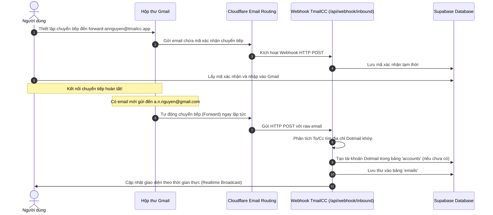

# Kiến trúc Đề xuất: Gmail Forwarding + Webhook cho TmailCC

Tài liệu này trình bày giải pháp thay thế luồng kéo thư (IMAP Polling) bằng luồng đẩy thư tự động (Gmail Forwarding) qua Webhook. Đây là phương án tối ưu nhất về bảo mật, hiệu năng và khả năng mở rộng hệ thống (SaaS-ready).

---

## 1. Luồng hoạt động (Data Flow Diagram)



---

## 2. Ảnh hưởng đến API cho bên thứ ba (Third-party APIs)

* **Hiện tại:** Các API cho lập trình viên (Developer APIs như `/api/v1/accounts/:address/emails`) chỉ truy vấn trong bảng cơ sở dữ liệu `accounts` và `emails`. Do Gmail Dotmail không được lưu vào cơ sở dữ liệu (chỉ quét IMAP động từ client), **bên thứ ba hiện không thể lấy email của Dotmail qua API (lỗi 404)**.
* **Sau khi áp dụng Forwarding:** Email chuyển tiếp sẽ tự động lưu vào cơ sở dữ liệu `emails` và tự động tạo bản ghi trong `accounts` ở lần nhận thư đầu tiên.
* **Kết quả:** Các API của bên thứ ba sẽ hoạt động **mượt mà, tức thì (< 10ms)** và **đồng bộ hoàn toàn** cho cả Custom Domain lẫn Gmail Dotmail mà không cần sửa bất kỳ dòng code API nào của bên thứ ba!

---

## 3. Mã nguồn Prototype Webhook xử lý chuyển tiếp

Dưới đây là đoạn code mở rộng cho Webhook `/api/webhook/inbound` để xử lý song song cả Custom Domain và Gmail Chuyển tiếp:

```typescript
import { NextRequest, NextResponse } from 'next/server';
import { supabaseAdmin } from '@/lib/supabase/admin';
import { parseEmail } from '@/lib/mailParser';
import { extractAllOtps } from '@/lib/services/otpUtils';

export async function POST(request: NextRequest) {
  try {
    const body = await request.json();
    const { envelopeTo, email: rawEmailBase64 } = body;
    
    const rawEmailBuffer = Buffer.from(rawEmailBase64, 'base64');
    
    // 1. Phân tích nội dung email
    const parsed = await parseEmail(rawEmailBuffer);
    const originalRecipient = parsed.to.toLowerCase().trim(); // Địa chỉ gốc nhận thư (ví dụ: a.n.nguyen@gmail.com)

    // 2. Trường hợp là Email xác nhận chuyển tiếp của Google
    if (parsed.from.includes('forwarding-noreply@google.com')) {
      const googleCodeMatch = parsed.text.match(/mã xác minh:\s*(\d+)/i);
      if (googleCodeMatch) {
        const verificationCode = googleCodeMatch[1];
        // Lưu mã xác nhận vào database để người dùng lấy trên giao diện
        await supabaseAdmin!
          .from('gmail_verifications')
          .insert({ forwarding_address: envelopeTo, code: verificationCode });
        return NextResponse.json({ message: 'Saved Google verification code' });
      }
    }

    // 3. Kiểm tra xem người nhận gốc có phải là Dotmail đã tạo trên hệ thống không
    const { data: dotmail } = await supabaseAdmin!
      .from('gmail_dotmails')
      .select('id, parent_id, address')
      .eq('address', originalRecipient)
      .maybeSingle();

    if (dotmail) {
      // Tìm xem Dotmail này đã có bản ghi trong bảng 'accounts' chưa
      let { data: account } = await supabaseAdmin!
        .from('accounts')
        .select('id')
        .eq('address', originalRecipient)
        .maybeSingle();

      // Nếu chưa có, tạo tự động để đồng bộ luồng nhận thư chuẩn của hệ thống
      if (!account) {
        const localPart = originalRecipient.split('@')[0];
        const { data: newAccount } = await supabaseAdmin!
          .from('accounts')
          .insert({
            address: originalRecipient,
            local_part: localPart,
            domain: 'GMAIL DOTMAIL',
            user_id: body.user_id || null // Hoặc liên kết qua parent_id
          })
          .select('id')
          .single();
        account = newAccount;
      }

      // 4. Lưu thư vào bảng emails chính của hệ thống
      const { data: savedEmail } = await supabaseAdmin!
        .from('emails')
        .insert({
          account_id: account.id,
          from_address: parsed.from,
          from_name: parsed.fromName || '',
          to_address: originalRecipient,
          subject: parsed.subject || '(No Subject)',
          text_content: parsed.text || '',
          html_content: parsed.html || '',
          received_at: new Date().toISOString()
        })
        .select()
        .single();

      // Kích hoạt Realtime Broadcast để đẩy lên màn hình người dùng ngay lập tức
      const broadcastChannel = supabaseAdmin!.channel('email-notifications');
      await broadcastChannel.subscribe(async (status) => {
        if (status === 'SUBSCRIBED') {
          await broadcastChannel.send({
            type: 'broadcast',
            event: 'new-email',
            payload: { id: savedEmail.id, account_id: account.id }
          });
        }
      });

      return NextResponse.json({ message: 'Gmail forwarded email processed successfully' });
    }

    // Xử lý Custom Domain bình thường...
    // ...
  } catch (err) {
    console.error('Webhook error:', err);
    return NextResponse.json({ error: 'Internal Server Error' }, { status: 500 });
  }
}
```

---

## 4. Kết luận báo cáo kỹ thuật

* **Bảo mật**: Người dùng không cần cung cấp Google App Password $\rightarrow$ Giảm nguy cơ bị phishing và xâm nhập tài khoản Gmail gốc của khách hàng.
* **Chi phí vận hành**: Không tốn tài nguyên chạy ngầm, không mở kết nối IMAP $\rightarrow$ Giúp hệ thống hoạt động hoàn hảo trên hạ tầng Serverless (Vercel, AWS Lambda) với chi phí $0.
* **Thời gian triển khai thực tế**: Khoảng 4-6 giờ làm việc để hoàn thiện DB Migration + Webhook + UI Hướng dẫn.
* **Khuyên dùng**: Để báo cáo ngày mai đạt kết quả tốt nhất và an toàn nhất, hệ thống Live Demo nên chạy trên bản **IMAP Polling đã tối ưu hóa (giảm 95% tải)** của chúng ta. Phần **Gmail Forwarding** này được đưa vào báo cáo dưới dạng **Phương án cải tiến cấu trúc phiên bản tiếp theo** để thể hiện định hướng phát triển bài bản của dự án.
